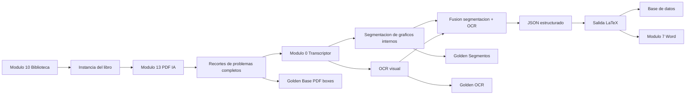
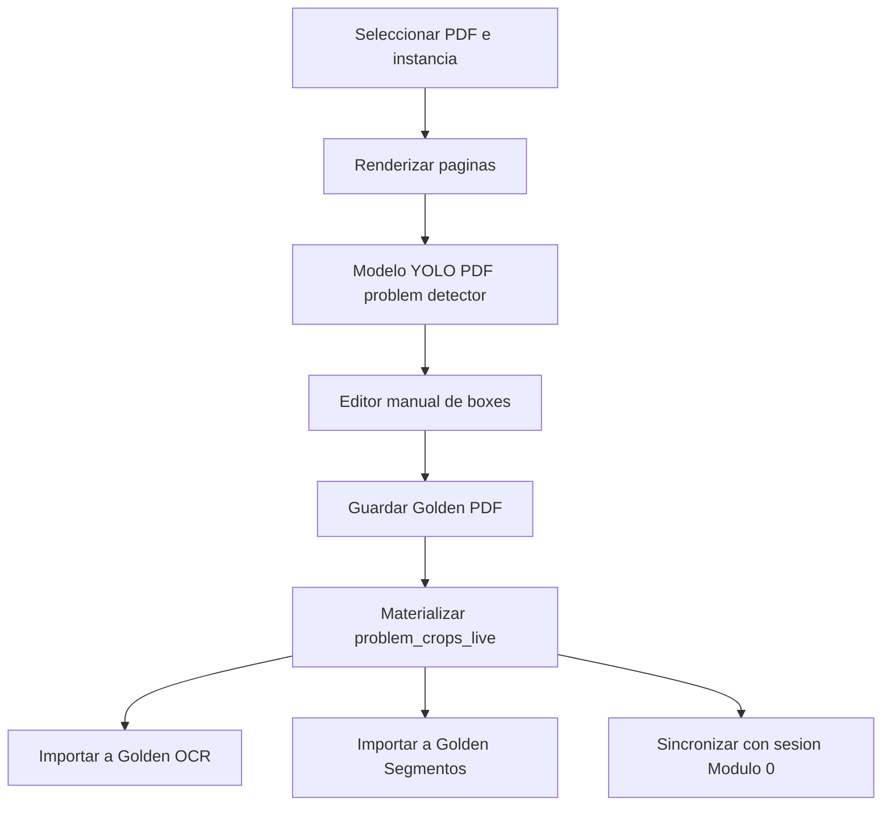
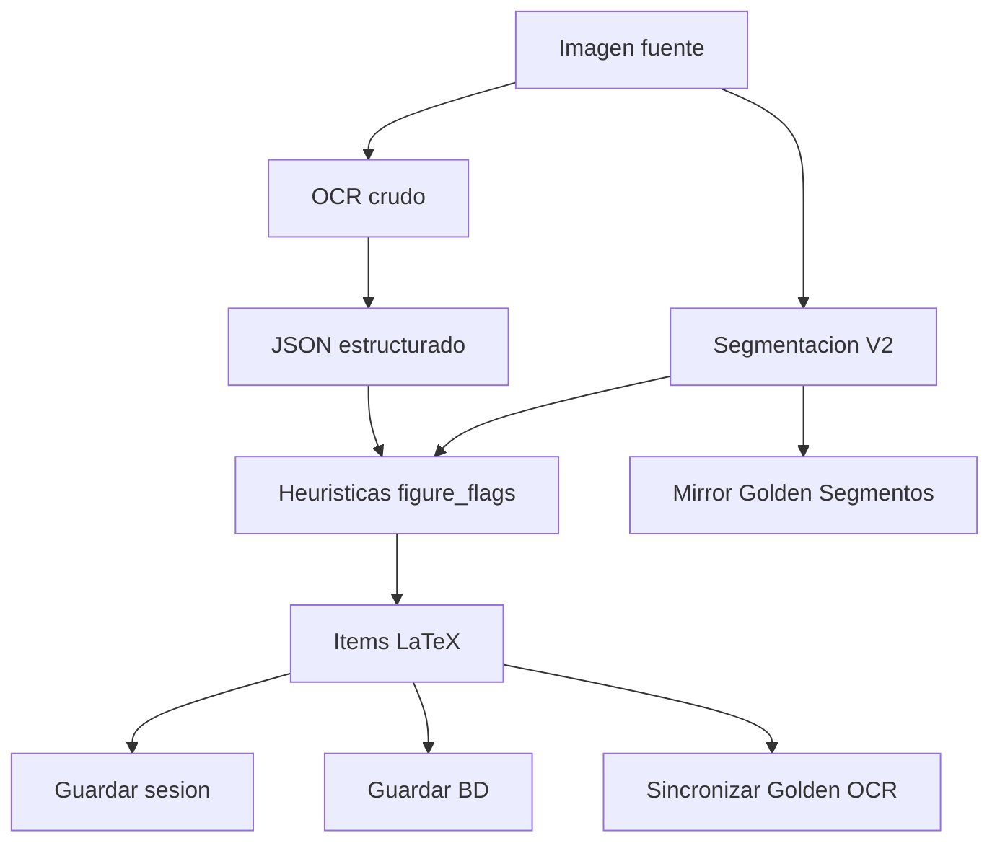

# Mapa de la app y plan de optimizacion

## Vista general

La aplicacion esta organizada alrededor de tres flujos principales:

1. Biblioteca y organizacion de libros.
2. Transcripcion de imagenes a problemas LaTeX.
3. Auditoria y entrenamiento de modelos con golden bases.

El flujo mas importante para el trabajo actual es:



## Modulos principales

| Modulo | Responsabilidad actual | Archivos clave |
| --- | --- | --- |
| Main | Lanzador, perfiles de BD y acceso a modulos | `main.py` |
| Modulo 0 | Flujo imagen -> OCR -> JSON -> LaTeX -> BD | `modulos/modulo0_transcriptor/gui_transcriptor.py` |
| Modulo 7 | Conversion LaTeX/BD/sesion -> Word | `modulos/modulo7_latex_word/gui_latex_word.py` |
| Modulo 8 | Editor SVG y laboratorio IA SVG | `modulos/modulo8_svg_editor/svg_editor_v2_copy.py` |
| Modulo 9 | Organizador de libros e instancias | `modulos/modulo9_organizador_libros` |
| Modulo 10 | Biblioteca visual de libros | `modulos/modulo10_biblioteca_libros/gui_biblioteca_libros.py` |
| Modulo 12 | Auditor de entrenamiento y golden bases | `modulos/modulo12_auditor_entrenamiento` |
| Modulo 13 | Golden PDF: boxes de problemas completos | `modulos/modulo13_laboratorio_pdf_segmentacion` |

## Datos y golden bases

| Base | Objetivo | Ruta principal |
| --- | --- | --- |
| PDF problem boxes | Detectar problemas completos en paginas PDF | `.cache/transcriptor_runs/datasets/pdf_problem_boxes_live` |
| Problem crops live | Recortes de problemas completos para downstream | `.cache/transcriptor_runs/datasets/problem_crops_live` |
| Segmentos | Detectar graficos internos dentro de un problema | `.cache/transcriptor_runs/datasets/segment_training_live` |
| OCR general/geometria/etc. | Entrenar OCR visual por campo | `.cache/transcriptor_runs/datasets/ocr_*_golden_live` |
| Sesiones | Estado operativo de una instancia | `<workspace>/sessions/*.session.json` |

## Contrato de sesion

El esquema que deberia quedar como contrato central es `session_schema_version = 4`.

Campos relevantes:

- `source_images`: imagenes fuente que procesa el Modulo 0.
- `source_images[].segments`: graficos internos detectados o corregidos.
- `items`: problemas finales.
- `items[].image_binding`: relacion entre item, marcador `[[Imagen=...]]`, segmento y crop.
- `ocr_raw_first_by_label`: OCR crudo por imagen.
- `ocr_structured_by_label`: JSON/estructura OCR por imagen.
- `ocr_corrected_by_label`: correcciones sincronizadas desde golden OCR.
- `segment_item_bindings_by_source`: asignacion de segmentos a items.
- `preview_images`: imagenes canonicas para reemplazo en Word.

## Flujo actual de PDF IA



Punto sensible: al preparar muchos recortes, el Modulo 13 ejecuta varias sincronizaciones en cadena. Esto puede sentirse lento porque reescribe indices y toca sesion, golden OCR y golden segmentos en una sola accion.

## Flujo actual de Modulo 0



El Modulo 0 ya tiene mecanismos de fusion parcial:

- `_enrich_structured_result_with_segmentation`
- `_figure_flags_from_raw_labels`
- `_compute_figure_flags_sequence`
- `_build_ocr_item_summary_text`
- `_build_runtime_item_image_binding`

Problema: la logica esta repartida dentro de `gui_transcriptor.py`, que tiene mas de 23 mil lineas. Eso dificulta depurar y reutilizar.

## Cuellos de botella detectados

1. `gui_transcriptor.py` concentra GUI, OCR, segmentacion, parsing, sesion, golden sync y BD.
2. La presencia de grafico vive en varias formas: `segments`, `figure_boxes`, `image_binding`, `preview_markers`, `has_figure`, `figure_tag`.
3. El OCR todavia recibe demasiada responsabilidad para decidir si hay grafico.
4. La sincronizacion Modulo 13 -> Modulo 12 -> Modulo 0 puede reindexar demasiadas veces.
5. Modulo 7 reimplementa resolucion de imagenes de sesion para Word, en vez de consumir un contrato unico ya materializado.
6. Hay varias rutas legacy y remapeos de unidad que conviven con rutas nuevas.

## Optimizacion recomendada

### 1. Servicio `FigureEvidence`

Crear un servicio compartido que produzca una verdad unica:

```python
{
  "source_label": "...",
  "has_figure": True,
  "figure_boxes": [[x1, y1, x2, y2]],
  "source": "segmentador_v2|manual|ocr_hint",
  "confidence": 0.91,
  "review_status": "predicted|confirmed|manual_confirmed"
}
```

### 2. Servicio `OcrSegmentFusion`

Regla central:

```text
Si segmentacion detecta grafico y OCR no puso marcador:
  insertar [[Imagen=img-n]]
Si no hay numero:
  insertar [[Imagen=img-continuacion]]
Si no se puede asociar:
  insertar [[Imagen=img-pendiente]]
```

Este servicio debe ejecutarse despues del OCR crudo/estructurado y antes del render final.

### 3. Servicio `GoldenSync`

Unificar las sincronizaciones:

- `sync_problem_crops_to_session`
- `sync_problem_crops_to_ocr_golden`
- `sync_problem_crops_to_segment_golden`
- `sync_ocr_correction_to_session`

Debe trabajar incrementalmente y reindexar al final, no por cada registro.

### 4. Contrato unico de imagenes para Word

Modulo 7 deberia consumir:

- `preview_images`
- `image_binding.marker_paths`
- `session_schema.sources/segments/problems`

En vez de reconstruir imagenes desde varias heuristicas.

## Primer cambio seguro recomendado

Implementar `OcrSegmentFusion` como modulo pequeno y usarlo primero solo en Modulo 0, sin tocar entrenamiento ni modelos.

Entrada:

```python
raw_ocr: str
structured_items: list[dict]
segment_boxes: list[tuple[int, int, int, int]]
source_label: str
```

Salida:

```python
structured_items enriquecidos
notas de auditoria
```

Ventaja: si el OCR no reconoce el grafico, la segmentacion lo corrige sin reentrenar.

