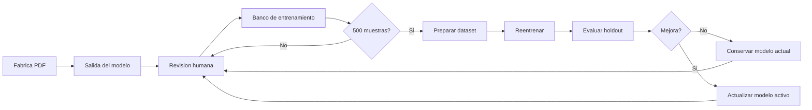
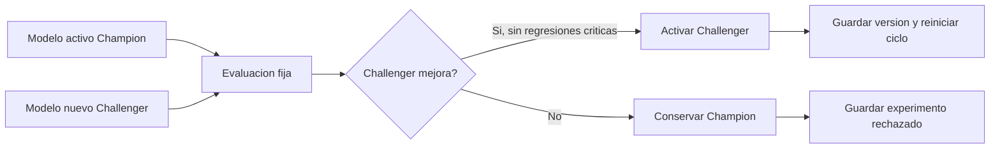

# Ciclo De Entrenamiento De Modelos

Fecha: 2026-06-14

## Objetivo

Mantener una base de entrenamiento separada para cada modelo de la Fabrica PDF, acumulando correcciones humanas hasta llegar a `500` muestras utiles por modelo. Al llegar a esa meta, se reentrena, se evalua, se actualiza el modelo activo si mejora, y luego el ciclo vuelve a empezar con nuevas correcciones.

## Flujo General



## Bancos Activos

| Modelo | Banco | Cuenta Como Muestra | Meta |
| --- | --- | --- | --- |
| Segmentacion de problemas | `problem_detector_corrections` / `pdf_problem_boxes_live` | Pagina con boxes de problemas corregidos o golden confirmada | 500 |
| OCR crudo | `ocr_golden_live` y bancos OCR especializados | Crop con OCR corregido/revisado | 500 |
| Segmentacion de graficos | `segment_training_live` | Imagen donde se corrigieron boxes de grafico | 500 |
| Normalizador final | `normalizer_training_bank` | Problema principal con formato final humano | 500 |

## Registro Comun

La Fabrica expone el estado consolidado en:

```text
GET /api/training/status
```

Cada tarea devuelve:

- `samples_total`
- `historical_samples_total`
- `cycle_baseline_samples`
- `target_samples`
- `remaining_samples`
- `ready_to_train`
- `roots`
- `train_action`

`samples_total` representa el avance del ciclo actual. `historical_samples_total` conserva todo lo acumulado y `cycle_baseline_samples` indica desde donde se reinicio el contador.

Para iniciar un nuevo ciclo sin borrar historico:

```text
POST /api/training/cycle/reset
```

o por CLI:

```powershell
python tools\reset_training_cycle.py --reason "Nuevo ciclo despues de actualizar modelos"
```

El estado se guarda en:

```text
.cache/transcriptor_runs/datasets/training_cycle_state.json
```

El normalizador conserva compatibilidad con:

```text
GET /api/training/normalizer/status
```

## Politica De Calidad

- Las correcciones humanas son el dato principal de entrenamiento.
- Los contadores del ciclo se reinician guardando una linea base; no se borran muestras.
- No se debe reentrenar por cantidad solamente; despues de llegar a 500 se debe evaluar contra un conjunto holdout.
- Solo se actualiza el modelo activo si mejora la metrica objetivo.
- Si el modelo empeora, se conserva el modelo anterior y el nuevo queda como experimento.
- La meta de confiabilidad `99%` se persigue por ciclos: recolectar, reentrenar, evaluar y repetir.

## Evaluacion Champion / Challenger

Cada modelo nuevo entrenado se trata como `Challenger`. El modelo activo en la app es el `Champion`.



Regla principal:

```text
Un modelo nuevo no reemplaza al actual porque termino de entrenar.
Solo reemplaza al actual si vence al Champion en evaluacion controlada.
```

## Conjuntos De Evaluacion

| Split | Uso | Se entrena con esto? |
| --- | --- | --- |
| `train` | Ajustar pesos del modelo | Si |
| `validation` | Revisar aprendizaje durante entrenamiento | No directamente |
| `test_fijo` | Comparar versiones entre ciclos | Nunca |
| `hard_errors` | Casos donde modelos anteriores fallaron | No para decidir solo; sirve como prueba de errores |

`test_fijo` debe mantenerse estable. Si se mezcla con entrenamiento, ya no sirve para medir mejora real.

## Metricas Por Modelo

### Segmentacion De Problemas

| Metrica | Que mide | Objetivo |
| --- | --- | --- |
| `map50` | Coincidencia general de boxes | Subir |
| `map50_95` | Precision fina del box | Subir |
| `problem_recall` | Problemas reales encontrados | Subir |
| `box_precision` | Boxes detectados que son problemas reales | Subir |
| `split_error_rate` | Un problema dividido en varios boxes | Bajar |
| `merge_error_rate` | Varios problemas unidos en un box | Bajar |
| `reading_order_accuracy` | Orden correcto de lectura | Subir |
| `human_box_edit_rate` | Porcentaje de boxes corregidos por humano | Bajar |

Activar nuevo detector solo si mejora `problem_recall`, baja `split_error_rate` y `merge_error_rate`, y no empeora el orden de lectura.

### OCR Crudo

| Metrica | Que mide | Objetivo |
| --- | --- | --- |
| `cer` | Error por caracter | Bajar |
| `wer` | Error por palabra | Bajar |
| `latex_token_accuracy` | Simbolos LaTeX correctos | Subir |
| `option_label_accuracy` | Alternativas A-E correctas | Subir |
| `number_accuracy` | Numero de problema correcto | Subir |
| `hallucination_rate` | Texto inventado por el modelo | Bajar |
| `format_pass_rate` | Respeta formato de OCR crudo | Subir |
| `empty_or_failed_rate` | Respuestas vacias o fallidas | Bajar |
| `human_ocr_edit_distance` | Cuanto corrige el humano | Bajar |

Activar nuevo OCR solo si baja `cer`, baja `hallucination_rate`, no aumenta `empty_or_failed_rate`, y reduce correccion humana.

### Segmentacion De Graficos

| Metrica | Que mide | Objetivo |
| --- | --- | --- |
| `figure_presence_f1` | Detecta correctamente si hay grafico | Subir |
| `graph_box_iou` | Ajuste del box del grafico | Subir |
| `false_positive_rate` | Marca grafico cuando no hay | Bajar |
| `missed_graph_rate` | Omite grafico cuando si hay | Bajar |
| `human_graph_edit_rate` | Porcentaje de segmentos corregidos | Bajar |

Activar nuevo segmentador de graficos solo si mejora `figure_presence_f1` y baja las correcciones humanas sin subir falsos positivos.

### Normalizador Final

| Metrica | Que mide | Objetivo |
| --- | --- | --- |
| `final_latex_exact_match` | Coincidencia exacta con salida humana | Subir |
| `render_pass_rate` | Render MathJax/LaTeX sin romper | Subir |
| `tag_accuracy` | Curso, tema, estado, clave e imagen | Subir |
| `option_block_accuracy` | Respeta bloque de alternativas final | Subir |
| `continuation_merge_accuracy` | Une correctamente `[CONT.]` | Subir |
| `image_tag_accuracy` | Usa `[[Imagen=img-n]]` solo cuando corresponde | Subir |
| `hallucination_rate` | Inventa datos no presentes | Bajar |
| `bd_validation_pass_rate` | Candidato valido para BD | Subir |
| `human_final_edit_distance` | Cuanto corrige el humano | Bajar |

Regla inicial para promover un normalizador:

```text
render_pass_rate >= 98%
tag_accuracy >= 95%
option_block_accuracy >= 97%
continuation_merge_accuracy >= 90%
hallucination_rate <= 2%
human_final_edit_distance mejora al menos 15%
no empeora mas de 3% en test_fijo
```

## Aprendizaje De Errores

Cada correccion humana debe guardar:

```json
{
  "model_stage": "normalizer",
  "model_version": "v1",
  "input": "...",
  "model_prediction": "...",
  "human_correction": "...",
  "error_type": "clave_mal_detectada",
  "severity": "alta",
  "book_code": "...",
  "instance_type": "...",
  "created_at": "..."
}
```

Esto permite formar el banco `hard_errors`, donde entran los fallos reales. El siguiente entrenamiento debe demostrar que reduce esos errores sin olvidar casos antiguos del `test_fijo`.

## Criterio De Activacion

| Resultado de evaluacion | Accion |
| --- | --- |
| Mejora metricas principales y no hay regresiones criticas | Activar modelo nuevo |
| Mejora en train pero no en test_fijo | Rechazar; conservar Champion |
| Mejora casos nuevos pero empeora antiguos | Rechazar o dejar como experimento |
| Baja calidad pero aporta casos utiles | Guardar errores para el siguiente ciclo |

## Variables De Configuracion

```text
TRAINING_SAMPLE_TARGET=500
PDF_PROBLEM_DETECTOR_TRAINING_TARGET=500
OCR_TRAINING_TARGET=500
SEGMENT_LIVE_GOLDEN_TARGET_CORRECTED=500
NORMALIZER_TRAINING_SAMPLE_TARGET=500
```

Las rutas pueden cambiarse con:

```text
TRAINING_DATASETS_ROOT
PDF_PROBLEM_DETECTOR_CORRECTIONS_ROOT
OCR_TRAINING_BANK_ROOTS
SEGMENT_LIVE_GOLDEN_BASE
NORMALIZER_TRAINING_BANK_ROOT
```
