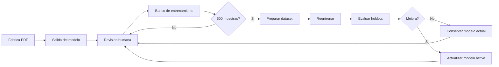

# Ciclo De Entrenamiento De Modelos

Fecha: 2026-06-14

## Objetivo

Mantener una base de entrenamiento separada para cada modelo de la Fabrica PDF, acumulando correcciones humanas hasta llegar a `500` muestras utiles por modelo. Al llegar a esa meta, se reentrena, se evalua, se actualiza el modelo activo si mejora, y luego el ciclo vuelve a empezar con nuevas correcciones.

## Flujo General



## Bancos Activos

| Modelo | Banco | Cuenta Como Muestra | Meta |
| --- | --- | --- | --- |
| Segmentacion de problemas | `problem_detector_corrections` / `pdf_problem_boxes_live` | Pagina con boxes de problemas corregidos o golden confirmada | 500 |
| OCR crudo | `ocr_golden_live` y bancos OCR especializados | Crop con OCR corregido/revisado | 500 |
| Segmentacion de graficos | `segment_training_live` | Imagen donde se corrigieron boxes de grafico | 500 |
| Normalizador final | `normalizer_training_bank` | Problema principal con formato final humano | 500 |

## Registro Comun

La Fabrica expone el estado consolidado en:

```text
GET /api/training/status
```

Cada tarea devuelve:

- `samples_total`
- `target_samples`
- `remaining_samples`
- `ready_to_train`
- `roots`
- `train_action`

El normalizador conserva compatibilidad con:

```text
GET /api/training/normalizer/status
```

## Politica De Calidad

- Las correcciones humanas son el dato principal de entrenamiento.
- No se debe reentrenar por cantidad solamente; despues de llegar a 500 se debe evaluar contra un conjunto holdout.
- Solo se actualiza el modelo activo si mejora la metrica objetivo.
- Si el modelo empeora, se conserva el modelo anterior y el nuevo queda como experimento.
- La meta de confiabilidad `99%` se persigue por ciclos: recolectar, reentrenar, evaluar y repetir.

## Variables De Configuracion

```text
TRAINING_SAMPLE_TARGET=500
PDF_PROBLEM_DETECTOR_TRAINING_TARGET=500
OCR_TRAINING_TARGET=500
SEGMENT_LIVE_GOLDEN_TARGET_CORRECTED=500
NORMALIZER_TRAINING_SAMPLE_TARGET=500
```

Las rutas pueden cambiarse con:

```text
TRAINING_DATASETS_ROOT
PDF_PROBLEM_DETECTOR_CORRECTIONS_ROOT
OCR_TRAINING_BANK_ROOTS
SEGMENT_LIVE_GOLDEN_BASE
NORMALIZER_TRAINING_BANK_ROOT
```
