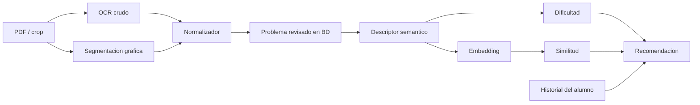

# Plan Del Descriptor Semantico, Similitud Y Recomendacion

Fecha: 2026-06-13

## Objetivo

Crear una capa posterior a la normalizacion que describa cada problema matematico de forma semantica, tanto si el problema es solo texto como si combina texto e imagen.

Esta capa permitira:

- vectorizar problemas revisados;
- encontrar problemas cercanos por similitud matematica;
- detectar duplicados o variantes;
- estimar dificultad;
- recomendar ejercicios especializados para cada alumno.

Esta fase no reemplaza el formato final LaTeX ni la subida a BD. Es una capa adicional de IA sobre problemas ya limpios y trazables.

## Ubicacion En La Arquitectura



Orden correcto:

1. Primero se obtiene un problema limpio.
2. Luego se genera el perfil semantico.
3. Despues se calcula el embedding.
4. Finalmente se usa para similitud, dificultad y recomendacion.

## Alcance V1

Incluido:

- problemas normales de libros;
- problemas solo texto;
- problemas con texto + imagen;
- descripcion de grafico como evidencia auxiliar;
- perfil JSON revisable;
- texto limpio para embedding;
- dificultad inicial estimada;
- campos preparados para revision humana.

Fuera de V1:

- resolver problemas automaticamente;
- demostrar teoremas;
- reemplazar la revision humana;
- recomendar ejercicios usando datos reales de alumnos;
- examenes mixtos de admision;
- problema-vs-solucion.

## Entradas

El descriptor debe recibir datos ya revisados o casi revisados.

Entrada minima:

```json
{
  "problem_id": "string",
  "latex_rendered_item": "\\item[...] ...",
  "raw_ocr": "<01.> ...",
  "course": "Geometria",
  "topic": "Triangulos",
  "subtopic": "",
  "answer_key": "E",
  "has_figure": true,
  "figure_tags": ["img-15"],
  "source": {
    "book_code": "string",
    "instance_type": "string",
    "page_number": 1,
    "crop_name": "string.png"
  }
}
```

Entrada opcional para problemas con imagen:

```json
{
  "geometry_figure_description": {
    "schema_version": "geometry_figure_description_v1",
    "figure_type": "geometria_plana",
    "construction_cdl": [],
    "condition_cdl": [],
    "evidence": []
  }
}
```

## Salida Principal: `problem_semantic_profile_v1`

Schema versionado:

```text
docs/schemas/problem_semantic_profile_v1.schema.json
```

```json
{
  "schema_version": "problem_semantic_profile_v1",
  "problem_id": "string",
  "modality": "text_only",
  "course": "Geometria",
  "topic": "Triangulos",
  "subtopic": "Angulos",
  "statement_summary": "Calcular x usando relaciones angulares en un triangulo.",
  "concepts": ["triangulos", "angulos", "suma de angulos"],
  "skills": [
    "identificar datos relevantes",
    "traducir relaciones geometricas",
    "plantear ecuacion simple"
  ],
  "objects": {
    "geometry": ["triangulo", "angulo"],
    "algebra": ["ecuacion lineal"],
    "arithmetic": []
  },
  "given_conditions": [
    "Se muestran angulos conocidos.",
    "Se pide calcular x."
  ],
  "unknowns": ["x"],
  "representation": {
    "embedding_text": "Geometria. Triangulos. Angulos. Calcular x con suma de angulos y relaciones visibles.",
    "search_keywords": ["geometria", "triangulos", "angulos", "x"],
    "canonical_problem_type": "calculo_de_angulo"
  },
  "difficulty": {
    "estimated_level": 2,
    "scale": "1-5",
    "signals": {
      "steps_estimated": 2,
      "requires_graph_reading": true,
      "requires_formula_memory": false,
      "requires_multi_case_reasoning": false,
      "requires_algebraic_manipulation": "low"
    },
    "reason": "Requiere leer el grafico y aplicar una relacion angular directa."
  },
  "evidence": {
    "uses_text": true,
    "uses_figure": true,
    "figure_tags": ["img-15"],
    "source_fields": ["latex_rendered_item", "raw_ocr", "figure_segmentation"]
  },
  "review": {
    "status": "sin_revisar",
    "human_verified": false,
    "notes": ""
  }
}
```

## Modalidades

| Modalidad | Valor | Descripcion |
| --- | --- | --- |
| Solo texto | `text_only` | El problema se entiende sin imagen. |
| Texto + imagen | `text_image` | Texto e imagen son necesarios. |
| Imagen dominante | `image_dominant` | El enunciado es corto y el grafico contiene la mayor parte de los datos. |
| Continuacion fusionada | `merged_continuation` | El problema viene de dos o mas crops unidos. |

## Descriptor De Grafico: `geometry_figure_description_v1`

Este descriptor es una evidencia auxiliar para el perfil semantico. No debe resolver el problema ni inventar condiciones por apariencia.

Schema versionado:

```text
docs/schemas/geometry_figure_description_v1.schema.json
```

```json
{
  "schema_version": "geometry_figure_description_v1",
  "source_record_id": "string",
  "figure_tag": "img-15",
  "figure_type": "geometria_plana",
  "visual_text": {
    "points": ["A", "B", "C"],
    "measure_labels": ["50^\\circ", "x^\\circ"],
    "other_labels": []
  },
  "primitives": {
    "points": ["A", "B", "C"],
    "segments": ["AB", "BC", "CA"],
    "circles": [],
    "arcs": []
  },
  "formalgeo_candidate": {
    "construction_cdl": ["Shape(ABC)"],
    "condition_cdl": [],
    "goal_cdl": []
  },
  "evidence": [
    {
      "predicate": "Shape(ABC)",
      "source": "line_detection",
      "confidence": 0.9
    }
  ],
  "warnings": [
    "No inferir paralelismo, igualdad o perpendicularidad sin marca visual o texto."
  ]
}
```

Regla clave:

```text
El grafico aporta hechos visibles. El razonamiento queda para otra capa.
```

## Ejemplo 1: Problema Solo Texto

Archivo de ejemplo:

```text
docs/examples/semantic_descriptor/text_only_algebra_equation.profile.json
```

Entrada:

```text
\item[\textbf{12.}] [[curso=Algebra]] [[tema=Ecuaciones lineales]] [[Estado=sin_revisar]] [[Clave=C]] Resolver $2x+5=17$. £A)$4$æB)$5$æC)$6$£D)$7$ææE)$8$£
```

Perfil esperado:

```json
{
  "schema_version": "problem_semantic_profile_v1",
  "modality": "text_only",
  "course": "Algebra",
  "topic": "Ecuaciones lineales",
  "statement_summary": "Resolver una ecuacion lineal de primer grado.",
  "concepts": ["ecuaciones lineales", "despeje"],
  "skills": ["despejar variable", "operar enteros"],
  "objects": {
    "geometry": [],
    "algebra": ["ecuacion lineal"],
    "arithmetic": ["suma", "resta", "division"]
  },
  "unknowns": ["x"],
  "representation": {
    "embedding_text": "Algebra. Ecuaciones lineales. Resolver 2x+5=17 despejando x.",
    "canonical_problem_type": "resolver_ecuacion_lineal"
  },
  "difficulty": {
    "estimated_level": 1,
    "scale": "1-5",
    "signals": {
      "steps_estimated": 2,
      "requires_graph_reading": false,
      "requires_formula_memory": false,
      "requires_multi_case_reasoning": false,
      "requires_algebraic_manipulation": "low"
    }
  }
}
```

## Ejemplo 2: Problema Texto + Grafico

Archivos de ejemplo:

```text
docs/examples/semantic_descriptor/text_image_geometry_angle.profile.json
docs/examples/semantic_descriptor/geometry_triangle_angle.figure.json
```

Entrada:

```text
\item[\textbf{15.}] [[curso=Geometria]] [[tema=Triangulos]] [[Estado=sin_revisar]] [[Clave=E]] Calcule $x$. [[Imagen=img-15]] £A)$10^\circ$æB)$20^\circ$æC)$45^\circ$£D)$30^\circ$ææE)$60^\circ$£
```

Perfil esperado:

```json
{
  "schema_version": "problem_semantic_profile_v1",
  "modality": "text_image",
  "course": "Geometria",
  "topic": "Triangulos",
  "statement_summary": "Calcular un angulo desconocido usando datos del grafico.",
  "concepts": ["triangulos", "angulos", "relaciones angulares"],
  "skills": ["leer grafico", "identificar angulos", "plantear relacion geometrica"],
  "objects": {
    "geometry": ["triangulo", "angulo", "segmento"],
    "algebra": ["ecuacion simple"],
    "arithmetic": []
  },
  "given_conditions": [
    "El enunciado pide calcular x.",
    "El grafico contiene las medidas necesarias."
  ],
  "unknowns": ["x"],
  "representation": {
    "embedding_text": "Geometria. Triangulos. Calculo de angulo x con grafico y relaciones angulares.",
    "canonical_problem_type": "calculo_de_angulo_con_grafico"
  },
  "difficulty": {
    "estimated_level": 2,
    "scale": "1-5",
    "signals": {
      "steps_estimated": 2,
      "requires_graph_reading": true,
      "requires_formula_memory": false,
      "requires_multi_case_reasoning": false,
      "requires_algebraic_manipulation": "low"
    }
  }
}
```

## Rubrica Inicial De Dificultad

Escala inicial `1-5`:

| Nivel | Descripcion |
| --- | --- |
| 1 | Aplicacion directa, uno o dos pasos, sin grafico complejo. |
| 2 | Requiere leer datos o hacer una relacion simple. |
| 3 | Combina varias relaciones o requiere elegir una estrategia. |
| 4 | Tiene varios pasos, construccion auxiliar, casos o algebra no trivial. |
| 5 | Problema retador, requiere insight, mezcla de temas o razonamiento largo. |

Senales para estimar dificultad:

- numero de pasos esperados;
- cantidad de datos relevantes;
- cantidad de distractores;
- necesidad de grafico;
- necesidad de formula memorizada;
- necesidad de transformacion algebraica;
- si combina temas;
- si requiere construccion auxiliar;
- tasa futura de acierto de alumnos.

La dificultad inicial es revisable:

```text
dificultad_inicial = descriptor + reglas + revision humana
dificultad_calibrada = dificultad_inicial + resultados reales de alumnos
```

## Embeddings Y Similitud

El embedding no debe generarse desde el OCR crudo ni desde rutas de archivo. Debe generarse desde `representation.embedding_text`.

Texto recomendado:

```text
<curso>. <tema>. <subtema>. <tipo canonico>. <conceptos>. <habilidades>. <condiciones principales>.
```

Ejemplo:

```text
Geometria. Triangulos. Angulos. Calculo de angulo con grafico. Leer relaciones angulares y plantear ecuacion simple.
```

La busqueda de similitud debe combinar:

- vector del perfil semantico;
- filtros por curso/tema/subtema;
- dificultad cercana;
- modalidad del problema;
- historial del alumno.

No basta con comparar texto literal, porque dos problemas pueden ser muy parecidos aunque usen palabras distintas.

## Recomendacion Al Alumno

Entrada futura del recomendador:

```json
{
  "student_id": "string",
  "target_course": "Geometria",
  "weak_skills": ["leer grafico", "relaciones angulares"],
  "current_level": 2,
  "recent_errors": ["calculo_de_angulo_con_grafico"]
}
```

Salida esperada:

```json
{
  "recommended_problem_ids": ["p1", "p2", "p3"],
  "reason": "Problemas cercanos a la habilidad debil, con dificultad progresiva.",
  "sequence": [
    {"problem_id": "p1", "purpose": "refuerzo directo"},
    {"problem_id": "p2", "purpose": "variacion cercana"},
    {"problem_id": "p3", "purpose": "ligero aumento de dificultad"}
  ]
}
```

## Almacenamiento Futuro

Opciones a decidir:

1. Tabla `problem_semantic_profiles`.
2. Campo JSONB en `problemas`.
3. Cache derivada en archivos y tabla de embeddings.

Propuesta inicial:

```text
problemas
problem_semantic_profiles
problem_embeddings
student_problem_attempts
student_skill_state
```

Separar embeddings de `problemas` evita ensuciar la tabla principal y permite recalcular perfiles cuando cambie el modelo.

## Fases De Implementacion

### Fase A: Contrato Y Ejemplos

- Congelar `problem_semantic_profile_v1`.
- Crear 20 ejemplos manuales.
- Revisar si los campos son suficientes.

### Fase B: Baseline Sin Modelo

- Generar perfiles con reglas simples desde curso/tema/formato final.
- Producir `embedding_text`.
- Revisar similitud manualmente.

### Fase C: Descriptor Con Modelo

- Usar ejemplos revisados para entrenar o ajustar un modelo pequeno.
- Comparar contra baseline.
- Medir alucinaciones y consistencia.

### Fase D: Embeddings Locales

- Elegir un modelo local de embeddings.
- Crear embeddings desde `embedding_text`.
- Probar busqueda por proximidad dentro de la BD local.

### Fase E: Dificultad Y Recomendacion

- Empezar con dificultad revisable.
- Registrar intentos de alumnos.
- Calibrar dificultad con aciertos, tiempo y errores.
- Generar secuencias de practica personalizadas.

## Metricas De Calidad

- JSON valido.
- Campos obligatorios presentes.
- Curso/tema coherentes.
- No inventa datos que no aparecen en texto o grafico.
- `embedding_text` limpio y estable.
- Problemas similares aparecen cerca en busqueda vectorial.
- La dificultad estimada coincide con revision humana.
- La recomendacion mejora con datos reales del alumno.

## Validacion De Contratos

Los schemas y ejemplos versionados se validan con:

```powershell
python tools/validate_semantic_descriptor_contracts.py `
  --path docs/examples/semantic_descriptor
```

La salida es un reporte `semantic_descriptor_validation_report_v1` con conteos de archivos validos e invalidos. Este validador debe ejecutarse antes de usar perfiles semanticos como datos de entrenamiento, embeddings o evaluacion.

## Decisiones Pendientes

- Modelo local de embeddings inicial.
- Si la dificultad se guarda en escala `1-5` o `0-100`.
- Si el perfil semantico se revisa en la Fabrica o en otro modulo.
- Como guardar historial del alumno sin mezclarlo con el banco de problemas.
- Como representar formalmente soluciones cuando retomemos problema-vs-solucion.
