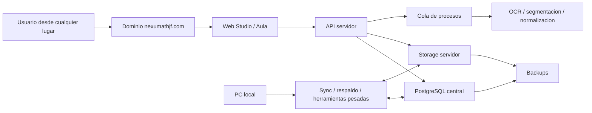

# Plan de despliegue remoto con dominio y base central

## Objetivo real

El programa debe dejar de depender de una PC local para operar. La meta es poder
trabajar desde cualquier lugar usando el dominio `nexumathjf.com` y mover la
base de datos al servidor para que sea la fuente oficial.

Esto cambia la prioridad: ya no se trata solo de mejorar la Fabrica local, ni de
mantener Math Tasks Studio como una web separada. El objetivo es que
`NexumathJF Studio` sea la entrada principal y que la experiencia actual de
Studio sea reemplazada por el flujo Biblioteca/Fabrica PDF, con la misma
capacidad de libros, instancias, staging, OCR, revision, BD y generacion Word.

Por tanto, el despliegue remoto debe separar claramente:

- servidor publico;
- base de datos central;
- almacenamiento de PDFs, portadas, imagenes y Words;
- procesos pesados de escaneo/OCR/modelos;
- respaldo local.

## Correccion de alcance: reemplazo de NexumathJF Studio

El destino no es abrir `Biblioteca/Fabrica` en localhost ni crear otra pagina
paralela. El destino es migrar la app web de `Auditor-IA` hacia
`E:\Github\MathContentStudio\scan-math-db` y reemplazar la seccion Studio de
`nexumathjf.com`.

Ruta local de la web actual:

```text
E:\Github\MathContentStudio\scan-math-db
```

Partes relevantes ya existentes:

```text
app/
  api/studio.py
  main.py
  math_bank.py
  web/
    studio-login.html
    studio-dashboard.html
    studio-instances.html
    studio-problems.html
    studio-pdf-open.html
    studio-pdf-viewer.html
```

La migracion debe convertir esas rutas en el nuevo Studio de Biblioteca/Fabrica:

- biblioteca de libros y portadas;
- instancias por libro;
- flujo PDF -> paginas -> boxes -> staging -> OCR -> revision -> BD;
- generacion Word por filtros y por sesiones;
- jobs persistentes para procesos largos;
- storage servidor para PDFs, crops, segmentos, portadas, Word y golden bases.

## Spec Kit activo

La migracion queda formalizada en:

```text
specs/003-nexumath-studio-factory/
```

Artefactos principales:

- `spec.md`: alcance funcional y criterios de exito;
- `plan.md`: plan tecnico de implementacion;
- `research.md`: decisiones de arquitectura;
- `data-model.md`: entidades principales;
- `contracts/`: contratos de API, jobs y migracion;
- `quickstart.md`: validacion manual/local/remota antes del corte.

## Estado de implementacion Spec Kit

### Corte 2026-07-06: US1 MVP remoto

Ya existe el primer punto de entrada remoto de Biblioteca/Fabrica dentro de
`scan-math-db`:

- `GET /studio/factory/bootstrap`;
- shell web `/web/studio-factory.html`;
- redireccion de usuarios `admin` y `collaborator` hacia el shell nuevo;
- enlace de retorno al Studio anterior como fallback;
- panel de salud para base de datos, storage, OCR, modelos y jobs activos;
- inventario publico de modelos sin exponer rutas locales;
- pruebas de contrato para sesion requerida y payload publico seguro.

Validaciones ejecutadas:

```text
E:\Github\MathContentStudio\scan-math-db\.venv\Scripts\python.exe -m unittest tests\test_studio_factory_bootstrap.py
E:\Github\MathContentStudio\scan-math-db\.venv\Scripts\python.exe -m unittest tests\test_api_flow.py
E:\Github\MathContentStudio\scan-math-db\.venv\Scripts\python.exe -m unittest discover -s tests -p "test_factory*.py"
python -m unittest tests.test_nexumath_studio_factory_audit
python tools\audit_nexumath_studio_factory.py
```

Resultado actual del auditor:

- `expected_factory_routes_present`: 1;
- `expected_factory_routes_missing`: 8;
- `studio_web_files_with_local_paths`: 0.

### Corte 2026-07-06: US2 biblioteca e instancias remotas

Ya existe el primer contrato remoto para navegar libros e instancias desde
`NexumathJF Studio`:

- `GET /studio/factory/books`;
- `GET /studio/factory/books/{book_id}/instances`;
- `GET /studio/factory/instances/{instance_id}/snapshot`;
- adaptador `factory_library.py` sobre la biblioteca actual;
- referencias publicas para portada/PDF sin exponer rutas Windows;
- advertencias de migracion cuando una portada o PDF aun no esta listo para
  storage del servidor;
- orden de libros priorizando trabajo en proceso y actividad reciente;
- orden natural de instancias para evitar `semana_10` antes de `semana_2`;
- tarjetas web de libros con contadores y panel de instancias con etapa actual.

Validaciones ejecutadas:

```text
E:\Github\MathContentStudio\scan-math-db\.venv\Scripts\python.exe -m py_compile app\factory_library.py app\api\studio_factory.py tests\test_studio_factory_library.py
E:\Github\MathContentStudio\scan-math-db\.venv\Scripts\python.exe -m unittest tests\test_studio_factory_library.py
E:\Github\MathContentStudio\scan-math-db\.venv\Scripts\python.exe -m unittest tests\test_studio_factory_bootstrap.py
E:\Github\MathContentStudio\scan-math-db\.venv\Scripts\python.exe -m unittest tests\test_api_flow.py
E:\Github\MathContentStudio\scan-math-db\.venv\Scripts\python.exe -m unittest discover -s tests -p "test_factory*.py"
C:\Users\Danny Fabián\.cache\codex-runtimes\codex-primary-runtime\dependencies\node\bin\node.exe --check app\web\studio-factory.js
python -m unittest tests.test_nexumath_studio_factory_audit
python tools\audit_nexumath_studio_factory.py
```

Resultado actual del auditor:

- `expected_factory_routes_missing`: 5.

### Corte 2026-07-06: US3 jobs persistentes

Ya existe infraestructura minima para registrar y recuperar jobs desde Studio:

- `POST /studio/factory/instances/{instance_id}/jobs`;
- `GET /studio/factory/jobs/{job_id}`;
- persistencia JSON bajo `FACTORY_JOB_ROOT`;
- redaccion de rutas privadas en IDs, opciones y errores de job;
- snapshot de instancia con jobs recientes;
- UI con boton `Cola OCR`, panel de progreso y recuperacion del ultimo job al
  recargar navegador.

Este bloque todavia no ejecuta OCR ni modelos; solo deja el contrato y la
observabilidad preparada para operaciones largas. La ejecucion real se conectara
cuando se implemente el worker/cola servidor.

Validaciones ejecutadas:

```text
E:\Github\MathContentStudio\scan-math-db\.venv\Scripts\python.exe -m py_compile app\factory_jobs.py app\factory_library.py app\api\studio_factory.py tests\test_studio_factory_jobs.py
E:\Github\MathContentStudio\scan-math-db\.venv\Scripts\python.exe -m unittest tests\test_studio_factory_jobs.py
E:\Github\MathContentStudio\scan-math-db\.venv\Scripts\python.exe -m unittest tests\test_studio_factory_library.py tests\test_studio_factory_jobs.py tests\test_studio_factory_bootstrap.py
C:\Users\Danny Fabián\.cache\codex-runtimes\codex-primary-runtime\dependencies\node\bin\node.exe --check app\web\studio-factory.js
python -m unittest tests.test_nexumath_studio_factory_audit
python tools\audit_nexumath_studio_factory.py
```

Resultado actual del auditor:

- `expected_factory_routes_missing`: 3.

Siguiente bloque:

- US4: revision/promocion a BD y generacion Word desde datos servidor.

## Arquitectura objetivo



## Decisiones de frontera

### 1. Base central

La base oficial debe vivir en PostgreSQL del servidor. La PC local puede quedar
como espejo o respaldo, pero no debe ser la fuente principal cuando ya estemos
trabajando remoto.

Bases involucradas:

- `scan_math.db` / base escolar de `scan-math-db`;
- `mathcontentstudio` / banco matematico real;
- `mathcontentstudio_local_mirror` / espejo local actual.

### 2. Storage central

Los archivos no deben quedar apuntando a rutas locales tipo `D:\Banco de
Preguntas` o `E:\Github`. En servidor deben quedar bajo una raiz estable, por
ejemplo:

```text
/srv/mathcontentstudio/
  library/
  generated_word/
  uploads/
  staging/
  backups/
```

Las tablas deben guardar rutas de servidor o identificadores de archivo, no
rutas absolutas de Windows.

### 3. Dominio

El repo `scan-math-db` ya contempla estos hostnames:

- `nexumathjf.com`
- `www.nexumathjf.com`
- `aula.nexumathjf.com`
- `studio.nexumathjf.com`
- `api.nexumathjf.com`

Esto se puede exponer con Cloudflare Tunnel o con reverse proxy directo en el
servidor.

### 4. Procesos pesados

Decision actual:

- El OCR entrenado se mantiene en Hugging Face.
- Los modelos locales actuales deben correr en el servidor:
  - segmentacion de problemas;
  - deteccion de numeracion y alternativas;
  - segmentacion de graficos;
  - modelos auxiliares ligeros.
- La Fabrica PDF debe avanzar hacia un flujo de jobs en servidor, con staging y
  storage remoto.

La razon es separar costos y complejidad: el servidor procesa lo que ya puede
ejecutarse con modelos locales, mientras Hugging Face queda solo para OCR.

## Lo que ya existe

En `E:\Github\MathContentStudio\scan-math-db` ya hay piezas utiles:

- `scripts/start_school_server.ps1`
- `scripts/start_cloudflared_tunnel.ps1`
- `scripts/cloudflared-config.example.yml`
- `scripts/migrate_sqlite_to_postgres.py`
- `scripts/export_math_bank_bundle.py`
- `scripts/restore_math_bank_bundle.py`
- `scripts/setup_math_bank_server.sh`
- `scripts/backup_math_bank.sh`
- `scripts/sync_math_bank_from_server.ps1`
- `docs/math-bank-server-migration.md`

Eso significa que no partimos de cero. Falta conectar esas piezas en un flujo de
produccion y decidir cual sera la fuente oficial.

## Ruta de implementacion

### Fase 1. Auditoria de datos

Objetivo: saber exactamente que se va a subir.

Checklist:

- identificar base local activa;
- contar tablas criticas;
- contar problemas, libros, instancias, origenes;
- detectar rutas Windows guardadas en BD;
- listar PDFs, portadas, imagenes, Words y staging que deben migrarse;
- detectar archivos faltantes;
- generar reporte antes de tocar el servidor.

Salida esperada:

```text
docs/reporte_pre_migracion_servidor.md
```

### Fase 2. Servidor base

Objetivo: dejar PostgreSQL y carpetas listas.

Checklist:

- crear base `mathcontentstudio`;
- crear usuario de app con permisos limitados;
- crear raiz `/srv/mathcontentstudio`;
- configurar backup nocturno;
- validar conexion local desde el servidor;
- no abrir PostgreSQL directo a internet.

### Fase 3. Migracion de base y archivos

Objetivo: subir datos y assets con validacion.

Checklist:

- exportar bundle del banco matematico;
- subir bundle al servidor;
- restaurar PostgreSQL;
- copiar PDFs y portadas;
- reescribir rutas a `/srv/mathcontentstudio/library`;
- validar conteos;
- validar que los PDFs existen;
- validar que la web puede leer libros e instancias.

### Fase 4. Publicar web por dominio

Objetivo: acceder por dominio estable.

Checklist:

- levantar API web en servidor;
- configurar `SCAN_MATH_DB_PUBLIC_BASE_URL=https://nexumathjf.com`;
- configurar subdominios;
- configurar HTTPS;
- validar `/health`;
- validar login;
- validar Biblioteca, Studio, Aula y API.

### Fase 5. Flujo operativo remoto

Objetivo: trabajar desde cualquier lugar sin depender de la PC local.

Checklist:

- subir libros/PDFs desde web;
- ver biblioteca desde dominio;
- generar Word desde servidor;
- consultar problemas por filtros;
- registrar cambios en BD central;
- descargar Word generado;
- mantener logs y backups.

### Fase 6. Fabrica PDF remota

Objetivo: mover el escaneo/OCR a un sistema remoto controlado.

Checklist:

- cola de jobs por instancia;
- upload de PDFs;
- storage de staging remoto;
- modelos locales configurados por entorno en el servidor;
- OCR Hugging Face con control de costos y ciclo de vida;
- jobs retomables si se corta la sesion;
- trazabilidad de correcciones para entrenamiento.

### Fase futura. Agentes

Los agentes quedan fuera del alcance inmediato. Se trabajaran cuando el servidor
y la Fabrica remota esten estables.

Agentes previstos:

- organizador de libros por curso e instancias;
- clasificador de paginas como teoria, resueltos o propuestos;
- verificador de segmentacion de problemas;
- verificador/corrector de OCR;
- curador de golden base;
- normalizador futuro.

## Primer corte recomendado

No conviene intentar mover todo de golpe. El corte minimo debe ser:

1. servidor con PostgreSQL;
2. banco matematico migrado;
3. PDFs y portadas en storage del servidor;
4. `scan-math-db` publicado en `nexumathjf.com`;
5. generacion Word funcionando desde la web remota;
6. PC local como respaldo y herramienta de fabrica hasta estabilizar.

Cuando eso este estable, recien movemos la Fabrica PDF completa al servidor.

## Estado de implementacion Spec Kit

Actualizado: 2026-07-06.

Completado en `scan-math-db`:

- entrada remota Studio Factory: `GET /studio/factory/bootstrap`;
- biblioteca remota: `GET /studio/factory/books`;
- instancias remotas: `GET /studio/factory/books/{book_id}/instances`;
- snapshot de instancia: `GET /studio/factory/instances/{instance_id}/snapshot`;
- jobs recuperables por instancia: `POST /studio/factory/instances/{instance_id}/jobs`;
- consulta de jobs: `GET /studio/factory/jobs/{job_id}`;
- guardado de revision staging: `POST /studio/factory/records/{record_id}/review`;
- seleccion Word persistente: `POST /studio/factory/word/selection`;
- registro de job Word: `POST /studio/factory/word/generate`.

Validaciones ejecutadas:

```text
E:\Github\MathContentStudio\scan-math-db\.venv\Scripts\python.exe -m unittest tests\test_studio_factory_library.py tests\test_studio_factory_jobs.py tests\test_studio_factory_bootstrap.py tests\test_studio_factory_word.py
E:\Github\MathContentStudio\scan-math-db\.venv\Scripts\python.exe -m unittest tests\test_api_flow.py
python -m unittest tests.test_nexumath_studio_factory_audit
python tools\audit_nexumath_studio_factory.py
```

Resultados:

- pruebas Factory US1-US4: 17 OK;
- flujo amplio `scan-math-db`: 31 OK;
- auditor Spec Kit: 4 OK;
- `expected_factory_routes_missing`: 0;
- `studio_web_files_with_local_paths`: 0.

Pendiente antes de declarar uso remoto completo:

- completar modo backup/local US6;
- migrar base y assets al servidor;
- validar smoke en el dominio con datos reales.

## Riesgos principales

- rutas absolutas de Windows guardadas en BD;
- PDFs o portadas faltantes;
- doble escritura entre local y servidor;
- credenciales dentro del repo;
- procesos OCR caros o largos ejecutandose sin cola;
- archivos grandes sin storage organizado;
- exponer PostgreSQL directamente a internet;
- no tener rollback si la migracion falla.

## Regla operativa

Antes de declarar el servidor como fuente oficial:

- backup local final;
- export final;
- restore validado;
- conteos validados;
- archivos validados;
- prueba web remota validada;
- ventana local congelada para evitar doble escritura.

## Plan Spec Kit actualizado 2026-07-06

La feature activa para este objetivo es:

```text
E:\Github\Auditor-IA\specs\003-nexumath-studio-factory
```

El plan operativo queda cerrado asi:

1. Reemplazar Studio por Biblioteca/Fabrica dentro de `scan-math-db`.
2. Usar PostgreSQL del servidor como fuente oficial despues del corte validado.
3. Usar storage del servidor para PDFs, portadas, crops, segmentos, Words y
   golden bases.
4. Mantener OCR en Hugging Face.
5. Ejecutar los modelos locales desde el servidor.
6. Convertir todos los procesos largos en jobs observables y recuperables.
7. Dejar la PC local como respaldo, espejo o herramienta auxiliar.

Estado actual:

- US1-US4 base estan implementados como contratos y UI inicial.
- La auditoria de rutas esperadas ya no reporta rutas Factory faltantes.
- El flujo aun no esta listo para corte productivo porque faltan tareas de
  cierre.

Pendiente critico agregado al Spec Kit:

- T064-T069: completado. El job Word ya genera `.tex` y `.docx` desde registros
  oficiales de math-bank, guarda artefactos en storage de Fabrica, expone
  endpoint de descarga y tiene pruebas de descarga/no fuga de rutas privadas.
- T047-T052: completado. Las correcciones humanas se guardan como datasets por
  modelo y el bootstrap/UI muestran contadores de entrenamiento.
- T053-T057: completado. El bootstrap/UI muestran el estado de corte, gates de
  backup/rollback/assets y advertencias de escritura local.
- T070-T071: smoke real de dominio, backup y rollback antes de declarar fuente
  oficial.

Criterio practico de finalizacion:

Un usuario debe poder entrar desde el dominio, abrir Biblioteca/Fabrica, trabajar
una instancia, recuperar jobs tras recargar, guardar revision, promover datos y
descargar un Word generado en servidor sin depender de rutas locales Windows.

### Avance T064-T069 - Word real remoto

Implementado en `E:\Github\MathContentStudio\scan-math-db`:

- `app/factory_word.py` ahora ejecuta el worker de Word al crear el job;
- el worker recolecta problemas desde `math_bank` por instancia o seleccion
  persistente;
- se generan dos artefactos:
  - `.tex` fuente;
  - `.docx` minimo y valido en formato Office Open XML;
- los artefactos se guardan bajo storage gestionado por Fabrica;
- `GET /studio/factory/word/jobs/{job_id}/download` permite descargar `docx`,
  `tex` o `manifest`;
- la UI muestra `Abrir Word` solo si el job termino y existe un artefacto;
- el auditor de compatibilidad ahora exige tambien la ruta de descarga.

Validaciones ejecutadas:

```text
E:\Github\MathContentStudio\scan-math-db\.venv\Scripts\python.exe -m unittest tests\test_studio_factory_word.py
E:\Github\MathContentStudio\scan-math-db\.venv\Scripts\python.exe -m unittest tests\test_studio_factory_library.py tests\test_studio_factory_jobs.py tests\test_studio_factory_bootstrap.py tests\test_studio_factory_word.py
python -m unittest tests.test_nexumath_studio_factory_audit
python tools\audit_nexumath_studio_factory.py
```

Resultados:

- Factory US1-US4 + Word real: 17 tests OK;
- auditor Spec Kit: 4 tests OK;
- `expected_factory_routes_missing`: 0;
- descarga `.docx`: validada en test como archivo Office ZIP.

### Avance T047-T052 - Training/correcciones humanas

Implementado en `E:\Github\MathContentStudio\scan-math-db`:

- `app/factory_training.py` centraliza las correcciones humanas como datos de
  entrenamiento;
- se guardan registros por tipo:
  - `problem_detector`;
  - `raw_ocr`;
  - `figure_segmenter`;
  - `normalizer_final`;
- cada correccion conserva `source_record_id`, `input_asset_ref`,
  `model_version`, `model_output`, `corrected_output`, metadata, usuario y
  fecha;
- `POST /studio/factory/records/{record_id}/review` delega al banco de
  entrenamiento para normalizador final, OCR crudo y segmentos graficos cuando
  el payload trae esos campos;
- existen helpers para guardar correcciones de segmentacion de problemas y
  segmentacion grafica desde futuros endpoints de boxes/segmentos;
- `GET /studio/factory/bootstrap` incluye contadores de training por modelo;
- la UI remota muestra el banco de entrenamiento y progreso hacia 500 muestras
  por modelo;
- los datos quedan sanitizados para no exponer rutas Windows privadas.

Validaciones ejecutadas:

```text
E:\Github\MathContentStudio\scan-math-db\.venv\Scripts\python.exe -m unittest tests\test_studio_factory_training.py
E:\Github\MathContentStudio\scan-math-db\.venv\Scripts\python.exe -m unittest tests\test_studio_factory_library.py tests\test_studio_factory_jobs.py tests\test_studio_factory_bootstrap.py tests\test_studio_factory_word.py tests\test_studio_factory_training.py
python -m unittest tests.test_nexumath_studio_factory_audit
python tools\audit_nexumath_studio_factory.py
```

Resultados:

- US5 training: 3 tests OK;
- Factory US1-US5: 20 tests OK;
- auditor Spec Kit: 4 tests OK;
- `expected_factory_routes_missing`: 0.

### Modo local como respaldo - US6

El servidor no debe convertirse en fuente oficial por accidente. Para eso el
bootstrap de Studio Factory expone un bloque `cutover` con estado de corte y
rol de la PC local.

Variables de entorno usadas por `scan-math-db`:

```text
SCAN_MATH_DB_FACTORY_OFFICIAL_SOURCE=false
SCAN_MATH_DB_FACTORY_LOCAL_WRITE_MODE=backup_only
SCAN_MATH_DB_FACTORY_BACKUP_VERIFIED=false
SCAN_MATH_DB_FACTORY_ROLLBACK_VERIFIED=false
SCAN_MATH_DB_FACTORY_ASSETS_MIGRATED=false
```

Modos permitidos para la PC local:

- `backup_only`: la PC local solo sirve para respaldo o inspeccion.
- `read_only`: la PC local puede consultar, pero no escribir.
- `sync`: la PC local puede sincronizar de forma explicita y reportable.
- `emergency_write`: la PC local puede escribir solo en modo emergencia
  controlado.

Regla:

- mientras `SCAN_MATH_DB_FACTORY_OFFICIAL_SOURCE=false`, Studio muestra que el
  servidor sigue en validacion;
- `can_declare_official=true` solo cuando backup, rollback y assets migrados
  estan verificados;
- si el servidor ya es oficial y la PC local tiene `sync` o `emergency_write`,
  la UI muestra advertencia de posible doble escritura.

Este bloque no migra datos por si mismo. Solo hace visible la puerta de corte y
evita operar con una fuente oficial ambigua.

Validacion local ejecutada:

```text
E:\Github\MathContentStudio\scan-math-db\scripts\test_local_studio_flow.ps1
  -Port 8077
  -StartIfNeeded
  -UseDemoMathBank
  -SkipDependencyInstall
  -StartupTimeoutSeconds 120
```

Resultado:

- servidor local activo;
- runtime listo;
- Studio listo;
- Math Bank demo listo;
- login admin Studio correcto;
- biblioteca, portada, PDF, ticket PDF, visor PDF, instancias y problemas
  validados.

Esto valida el smoke local de Studio Factory. No reemplaza el smoke real del
dominio, que sigue pendiente hasta desplegar en `nexumathjf.com`.

### Scripts de cierre remoto - T070/T071

Se agregaron dos scripts operativos en
`E:\Github\MathContentStudio\scan-math-db\scripts` para cerrar el corte remoto
sin depender de una prueba manual dispersa.

Smoke remoto:

```text
test_remote_studio_factory.ps1
```

Uso esperado:

```powershell
$env:SCAN_MATH_DB_REMOTE_BASE_URL = "https://nexumathjf.com"
$env:SCAN_MATH_DB_REMOTE_STUDIO_IDENTIFIER = "<usuario-studio>"
$env:SCAN_MATH_DB_REMOTE_STUDIO_PASSWORD = "<password>"

powershell -NoProfile -ExecutionPolicy Bypass -File scripts\test_remote_studio_factory.ps1
```

Cuando el servidor ya tenga una instancia segura para prueba completa:

```powershell
powershell -NoProfile -ExecutionPolicy Bypass -File scripts\test_remote_studio_factory.ps1 -RequireOfficialReady -AllowJobWrite -AllowWordGeneration
```

Valida:

- `/health`;
- login;
- bootstrap Factory;
- biblioteca;
- instancias;
- snapshot;
- job opcional;
- Word opcional;
- ausencia de rutas Windows, tokens, rutas privadas del servidor y tracebacks en
  respuestas publicas.

Readiness de backup/rollback:

```text
test_factory_cutover_readiness.ps1
```

Uso no estricto:

```powershell
powershell -NoProfile -ExecutionPolicy Bypass -File scripts\test_factory_cutover_readiness.ps1
```

Uso estricto para corte real:

```powershell
powershell -NoProfile -ExecutionPolicy Bypass -File scripts\test_factory_cutover_readiness.ps1 `
  -Strict `
  -BackupRef "<backup-file-or-server-ref>" `
  -MigrationManifestPath "<migration-manifest.json>" `
  -RollbackPlanPath "<rollback-plan.md>"
```

Valida:

- scripts de backup/export/restore;
- runbook de migracion;
- manifest con source, target, counts y rollback;
- gates remotos `backup_verified`, `rollback_verified` y `assets_migrated`;
- bloqueo de escritura local no oficial;
- reporte JSON bajo `storage\diagnostics`.

Estado:

- T070 y T071 siguen pendientes.
- No se debe marcar `SCAN_MATH_DB_FACTORY_OFFICIAL_SOURCE=true` hasta que ambos
  checks pasen contra el servidor real y la migracion de DB/assets este
  verificada.

### Paquete productivo de servidor - T072/T075

Se agrego un paquete productivo separado en
`E:\Github\MathContentStudio\scan-math-db` para desplegar NexumathJF Studio sin
usar el `docker-compose.yml` local de desarrollo.

Archivos:

- `docker-compose.production.yml`;
- `.env.production.example`;
- `deploy\postgres\init-mathcontentstudio.sh`;
- `docs\nexumathjf-production-deploy.md`;
- `scripts\test_production_deploy_config.ps1`.
- `scripts\build_nexumath_studio_release.ps1`.
- `scripts\build_factory_cutover_packet.ps1`.
- `scripts\deploy_nexumath_studio_release.ps1`.
- `scripts\run_nexumath_studio_cutover.ps1`.

Decisiones de seguridad:

- PostgreSQL no expone `5432` al host ni a Internet.
- La API se publica solo en `127.0.0.1:${NEXUMATH_API_PORT}` para quedar detras
  de Cloudflare Tunnel, Nginx, Caddy o proxy equivalente.
- Las claves demo del compose local no aparecen en la plantilla productiva.
- La fuente oficial sigue desactivada por defecto:
  `SCAN_MATH_DB_FACTORY_OFFICIAL_SOURCE=false`.
- El corte oficial depende de T070/T071, no solo de levantar contenedores.

Validacion local ejecutada:

```powershell
powershell -NoProfile -ExecutionPolicy Bypass -File scripts\test_production_deploy_config.ps1
```

Resultado:

- compose productivo encontrado;
- env productivo encontrado;
- Postgres sin puerto publico;
- API solo en localhost;
- passwords obligatorios por variables;
- modo de corte en validacion por defecto;
- sin valores demo;
- bundle `nexumath_studio_smoke.zip` regenerado; resumen con `file_count=148`
  y ZIP con 149 entradas incluyendo manifest, limpio sin `.env` real, storage,
  `.venv`, cache ni base local;
- manifiesto persistente generado junto al ZIP:
  `storage\releases\nexumath_studio_smoke.manifest.json`;
- paquete de corte `migration_smoke` generado con `migration-manifest.json` y
  `rollback-plan.md`;
- readiness no estricto validado con el paquete de corte y backup ref tipo
  servidor; las rutas locales de warnings quedan redactadas;
- readiness estricto endurecido: rechaza manifiestos sin conteos `target`,
  exige coincidencia source/target, `validation.status=passed`, sin archivos
  faltantes, sin rutas locales pendientes y rollback disponible;
- paquete `migration_smoke_strict` generado con conteos post-restore simulados
  para validar que el strict llega hasta el bloqueo remoto esperado;
- helper `deploy_nexumath_studio_release.ps1` agregado para subir el ZIP limpio
  por SSH/SCP, preservar `.env.production`, validar `docker compose config` y
  opcionalmente levantar el stack y probar `/health`;
- runner `run_nexumath_studio_cutover.ps1` agregado para ejecutar en orden:
  build del release, deploy, smoke remoto, paquete de corte y readiness strict;
- el runner fue probado en `-DryRun` y en modo local seguro con `-SkipDeploy`
  y `-SkipRemoteSmoke`, generando `migration_cutover_latest`;
- reporte JSON generado en `storage\diagnostics`.

Limitacion:

- Docker no esta disponible en esta PC, por lo que `docker compose config` debe
  ejecutarse en el servidor o en una maquina con Docker antes del despliegue.
- El servidor real y el dominio todavia no fueron validados desde este flujo;
  T070 y T071 permanecen pendientes hasta ejecutar el smoke remoto con
  credenciales reales.
- Verificacion publica actual: `https://api.nexumathjf.com/health` responde OK,
  pero `https://nexumathjf.com/studio` y
  `https://nexumathjf.com/studio/factory/bootstrap` devuelven 404. Esto indica
  que el reemplazo Studio Factory aun no esta publicado en el dominio principal.
