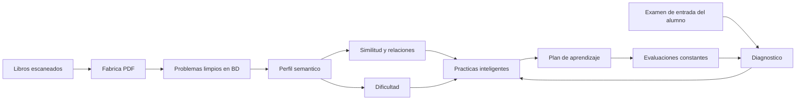
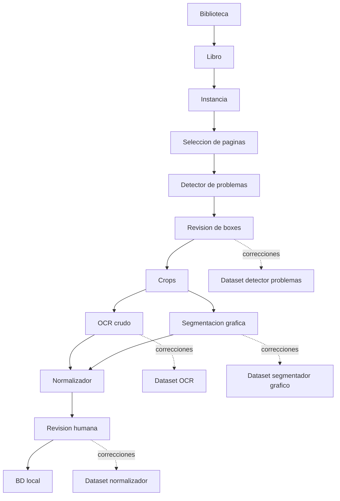
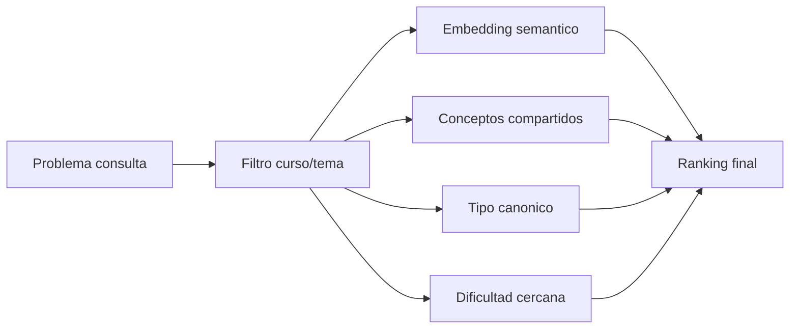
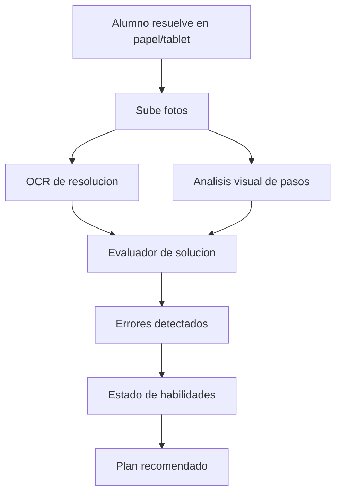
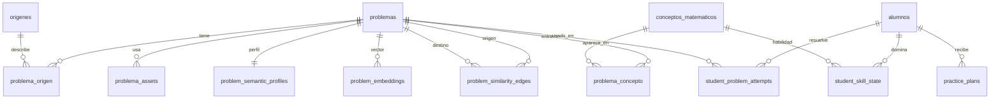

# Plan Maestro: Banco Relacional Y App De Aprendizaje Adaptativo

Fecha: 2026-06-15

## Vision

El objetivo final no es solo escanear libros. El objetivo es construir una base de problemas matematicos que permita entender que conceptos, propiedades, teoremas y habilidades trabaja cada problema, para despues recomendar practicas realmente utiles a cada alumno.

La ruta completa es:



La app debe evolucionar en dos productos conectados:

| Producto | Usuario | Proposito |
| --- | --- | --- |
| Fabrica / Auditor IA | Nosotros / docentes | Extraer, revisar, entrenar modelos y construir la base. |
| App del alumno | Alumno | Diagnosticar nivel, practicar, recibir recomendaciones y medir progreso. |

## Principios

- Primero calidad de datos, despues IA adaptativa.
- Staging antes de BD final.
- Toda correccion humana alimenta entrenamiento.
- La BD final debe ser relacional y semantica, no solo un deposito de LaTeX.
- El problema visible en BD conserva el formato final compatible con Modulo 7.
- La capa semantica vive como tablas adicionales versionadas.
- Los modelos proponen, el humano confirma cuando el dato impacta la base.
- La app de alumnos no debe iniciarse fuerte hasta que tengamos suficientes problemas confiables.

## Donde Estamos Ahora

Foto tomada desde `GET /api/training/status` el 2026-06-15:

| Modelo / banco | Historico | Ciclo actual | Meta por ciclo | Estado |
| --- | ---: | ---: | ---: | --- |
| Segmentacion de problemas | 1075 paginas | 0 | 500 | Hay base historica; ciclo reiniciado. |
| OCR crudo | 481 crops | 0 | 500 | Casi suficiente historico para otro entrenamiento, pero ciclo nuevo esta en cero. |
| Segmentacion de graficos | 43 imagenes corregidas | 0 | 500 | Falta recolectar mucho mas. |
| Normalizador final | 300 problemas | 0 | 500 | Primera version entrenada/probada; falta robustecer. |

Interpretacion:

- Estamos en la fase de construccion de la Fabrica y de los bancos de entrenamiento.
- Ya existe el flujo Biblioteca -> Instancia -> Paginas -> Boxes -> Crops -> OCR -> Segmentos -> Revision -> BD final.
- Ya existe subida a BD local, pero la capa semantica relacional aun no esta construida.
- Ya existe un plan para descriptor semantico en `docs/plan_descriptor_semantico_recomendacion.md`.
- Ya existe plan de ciclo de entrenamiento en `docs/plan_ciclo_entrenamiento_modelos.md`.
- El siguiente salto no es hacer todavia la app del alumno; es convertir la BD final en una base consultable por conceptos, similitud y dificultad.

## Arquitectura Objetivo

### Capa 1: Ingestion Y Extraccion

Responsabilidad: convertir libros en problemas limpios.



Estado actual: en curso y funcionando, pero necesita estabilidad y mas datos corregidos.

### Capa 2: BD Final Relacional

Responsabilidad: guardar problemas confirmados y su trazabilidad.

Tablas actuales importantes:

- `problemas`
- `origenes`
- `problema_origen`
- tablas de libros/instancias de Biblioteca
- tablas de temas/subtemas si estan disponibles en la BD

Tablas a agregar para que la BD sea relacional y pedagogica:

| Tabla propuesta | Proposito |
| --- | --- |
| `problema_assets` | Imagenes canonicas por problema: `img-15.png`, continuaciones, graficos. |
| `problem_semantic_profiles` | JSON versionado con conceptos, habilidades, objetos, dificultad inicial. |
| `problem_embeddings` | Vector derivado de `embedding_text`, no del OCR crudo. |
| `conceptos_matematicos` | Catalogo de conceptos, propiedades, teoremas, operaciones y tecnicas. |
| `problema_concepto` | Relacion N:N entre problema y concepto. |
| `problem_similarity_edges` | Pares de problemas cercanos con score y razon. |
| `problem_difficulty_estimates` | Dificultad estimada, version del modelo y revision humana. |

La idea no es meter todo en `problemas`. `problemas` guarda el enunciado final; las relaciones viven alrededor.

### Capa 3: Perfil Semantico

Responsabilidad: convertir un problema limpio en una descripcion pedagogica.

Entrada:

```text
problema final revisado
+ curso / tema / subtema
+ OCR crudo revisado
+ imagenes canonicas
+ segmentacion grafica
+ origen
```

Salida:

```json
{
  "schema_version": "problem_semantic_profile_v1",
  "course": "Geometria",
  "topic": "Triangulos",
  "concepts": ["angulos", "suma de angulos", "triangulo isosceles"],
  "skills": ["leer grafico", "plantear relacion angular"],
  "canonical_problem_type": "calculo_de_angulo_con_grafico",
  "difficulty": {
    "estimated_level": 2,
    "signals": {
      "requires_graph_reading": true,
      "steps_estimated": 2
    }
  },
  "embedding_text": "Geometria. Triangulos. Calculo de angulo con grafico. Leer relaciones angulares y plantear ecuacion simple."
}
```

Primera version recomendada:

1. Baseline por reglas.
2. Revision humana de perfiles.
3. Modelo pequeno entrenado con perfiles revisados.
4. Embeddings locales desde `embedding_text`.

### Capa 4: Similitud Y Relaciones

Responsabilidad: responder preguntas como:

- Que problemas son parecidos a este?
- Que problemas usan la misma propiedad?
- Que problemas son una variacion mas facil o mas dificil?
- Que problemas conviene dar antes de este?

La similitud debe ser hibrida:



No basta con embeddings. Dos problemas pueden tener texto parecido pero entrenar habilidades distintas. Tambien puede pasar lo inverso: texto distinto, misma propiedad.

Propuesta de scoring inicial:

```text
score_total =
  0.45 * similitud_embedding
+ 0.25 * conceptos_compartidos
+ 0.15 * tipo_canonico
+ 0.10 * cercania_dificultad
+ 0.05 * mismo_formato_o_modalidad
```

Esto debe ser ajustable con datos reales.

### Capa 5: Diagnostico Del Alumno

Responsabilidad: entender el nivel del alumno a partir de un examen de entrada, idealmente escrito.

Flujo futuro:



Tipos de errores que debemos detectar:

| Tipo de error | Ejemplo |
| --- | --- |
| Conceptual | Usa una propiedad que no corresponde. |
| Procedimental | Sabe la idea pero opera mal. |
| Lectura grafica | Lee mal un angulo, segmento o dato del diagrama. |
| Algebraico | Despeje, signos, fracciones, potencias. |
| Estrategia | No reconoce que tecnica aplicar. |
| Notacion | Escribe relaciones ambiguas o incompletas. |

Primera version sin modelo fuerte:

- examen diagnosticado con problemas ya conocidos de la BD;
- respuestas del alumno capturadas como imagen;
- revision humana asistida;
- clasificacion manual/semiautomatica de error;
- actualizacion de `student_skill_state`.

### Capa 6: Recomendador Y Plan De Aprendizaje

Responsabilidad: construir una secuencia de practica que lleve al alumno desde su nivel actual al objetivo.

Entrada:

```json
{
  "student_id": "S1",
  "weak_skills": ["leer grafico", "plantear ecuacion angular"],
  "current_level": 2,
  "target_course": "Geometria",
  "recent_errors": ["lectura_grafica", "relacion_angular"]
}
```

Salida:

```json
{
  "sequence": [
    {"purpose": "refuerzo directo", "difficulty": 1},
    {"purpose": "variacion cercana", "difficulty": 2},
    {"purpose": "transferencia", "difficulty": 3},
    {"purpose": "evaluacion corta", "difficulty": 2}
  ]
}
```

Regla pedagogica central:

```text
No recomendar solo problemas parecidos.
Recomendar una progresion: requisito -> refuerzo -> variacion -> reto -> evaluacion.
```

## Modelo De Datos Propuesto



### Tabla: `conceptos_matematicos`

Campos sugeridos:

- `id`
- `codigo`
- `nombre`
- `tipo`: `concepto`, `propiedad`, `teorema`, `operacion`, `tecnica`
- `curso`
- `tema`
- `subtema`
- `descripcion`
- `prerequisitos_json`
- `estado`: `activo`, `candidato`, `rechazado`

### Tabla: `problema_concepto`

Campos sugeridos:

- `problema_id`
- `concepto_id`
- `rol`: `usa`, `entrena`, `prerequisito`, `distractor`, `objetivo`
- `confidence`
- `source`: `humano`, `modelo`, `regla`
- `review_status`

### Tabla: `problem_semantic_profiles`

Campos sugeridos:

- `problema_id`
- `schema_version`
- `profile_json`
- `embedding_text`
- `model_version`
- `review_status`
- `created_at`
- `updated_at`

### Tabla: `student_problem_attempts`

Campos sugeridos:

- `student_id`
- `problema_id`
- `practice_id`
- `answer`
- `is_correct`
- `time_seconds`
- `solution_image_path`
- `error_profile_json`
- `review_status`

### Tabla: `student_skill_state`

Campos sugeridos:

- `student_id`
- `concepto_id`
- `mastery_score`: 0 a 1
- `evidence_count`
- `last_seen_at`
- `weakness_reason`
- `next_review_at`

## Fases De Ejecucion

### Fase 0: Estabilizar Fabrica Actual

Objetivo: que extraer problemas sea confiable y rapido.

Entregables:

- selector de paginas estable;
- boxes sincronizados con crops/OCR;
- imagenes canonicas correctas en BD;
- normalizador local usable;
- errores copiables y visibles por instancia;
- tests de staging/BD/normalizador.

Estado: en curso, bastante avanzado.

### Fase 1: Completar Bancos De Entrenamiento

Objetivo: mejorar los modelos base antes de construir inteligencia encima.

Prioridad:

1. Segmentacion de problemas.
2. OCR crudo.
3. Normalizador final.
4. Segmentacion de graficos.

Acciones:

- recolectar correcciones reales;
- llegar a 500 muestras por ciclo;
- evaluar champion/challenger;
- actualizar modelo solo si mejora;
- conservar hard errors.

Estado: activo.

### Fase 2: BD Final Con Imagenes Y Trazabilidad

Objetivo: cada problema subido debe quedar listo para practica y para perfil semantico.

Entregables:

- `problemas` con formato final correcto;
- `db_images` con nombres canonicos;
- origen estructurado;
- validacion para Modulo 7;
- reporte de subida a BD.

Estado: en curso.

### Fase 3: Perfil Semantico V1

Objetivo: crear `problem_semantic_profile_v1` para problemas ya revisados.

Entregables:

- tabla `problem_semantic_profiles`;
- generador baseline por reglas;
- UI simple para revisar perfil;
- 100 perfiles revisados manualmente;
- exportador de dataset semantico.

Estado: planificado; es el siguiente gran bloque despues de estabilizar BD.

### Fase 4: Busqueda Por Similitud

Objetivo: encontrar problemas cercanos por concepto, habilidad y dificultad.

Entregables:

- embeddings locales;
- tabla `problem_embeddings`;
- endpoint `buscar similares`;
- vista interna para comparar resultados;
- evaluacion manual de top-k.

Estado: futuro cercano.

### Fase 5: Catalogo De Conceptos Y Grafo Pedagogico

Objetivo: que la BD sepa que propiedad o habilidad entrena cada problema.

Entregables:

- catalogo de conceptos;
- relaciones problema-concepto;
- prerequisitos entre conceptos;
- revision humana de candidatos;
- soporte para "problemas que trabajan la misma propiedad".

Estado: futuro cercano, dependiente del perfil semantico.

### Fase 6: Diagnostico Del Alumno

Objetivo: medir nivel inicial del alumno.

Entregables:

- evaluaciones diagnosticas generadas desde la BD;
- captura de respuesta escrita;
- revision asistida de errores;
- `student_skill_state`;
- reporte de fortalezas/debilidades.

Estado: futuro; no conviene acelerar hasta tener una BD semantica util.

### Fase 7: App Del Alumno

Objetivo: practicar, recibir plan y medir progreso.

Entregables:

- login/perfil del alumno;
- evaluacion de entrada;
- practicas recomendadas;
- historial de intentos;
- tablero de progreso;
- plan semanal adaptativo.

Estado: futuro.

## Que Conviene Acelerar Y Que Conviene Esperar

### Acelerar Ahora

- Extraccion de problemas desde libros.
- Normalizador final y guardado en BD.
- Correccion de imagenes canonicas.
- Bancos de entrenamiento por modelo.
- Primer contrato semantico y pruebas manuales.

### Esperar Un Poco

- App final para alumnos.
- Analisis automatico completo de resoluciones escritas.
- Motor complejo de recomendacion.
- Examenes mixtos de admision.
- Problema vs solucion.

Motivo:

```text
Sin una BD limpia y semantica, la app del alumno solo tendria problemas sueltos.
Con una BD semantica, la app puede explicar por que recomienda cada practica.
```

## Primer MVP Realista

MVP interno:

```text
Fabrica estable
-> subir 500-1000 problemas revisados a BD
-> generar perfil semantico baseline
-> buscar problemas similares
-> generar practica por tema/habilidad
```

MVP alumno:

```text
diagnostico corto
-> detectar habilidades debiles manual/asistido
-> recomendar secuencia de 10 problemas
-> registrar aciertos/errores
-> ajustar siguiente practica
```

## Metricas Del Proyecto

### Calidad De Extraccion

- porcentaje de paginas sin correccion de boxes;
- porcentaje de crops con OCR usable;
- tasa de errores por instancia;
- tiempo promedio por problema revisado;
- porcentaje de problemas que llegan a BD sin retrabajo.

### Calidad De Normalizacion

- render LaTeX correcto;
- alternativas completas;
- clave no inventada;
- imagen correcta;
- `[CONT.]` fusionado correctamente;
- distancia de edicion humana.

### Calidad Semantica

- conceptos correctos;
- habilidades correctas;
- dificultad razonable;
- top-5 similares aceptados por humano;
- duplicados/variantes detectados.

### Calidad Pedagogica

- mejora de acierto por habilidad;
- reduccion de errores repetidos;
- tiempo hasta dominar una habilidad;
- retencion en evaluaciones posteriores;
- satisfaccion del alumno/docente.

## Proximos Pasos Concretos

1. Mantener la Fabrica como prioridad hasta que la subida a BD sea confiable.
2. Subir un primer bloque amplio de problemas normales a la BD local.
3. Crear migracion o servicio para `problem_semantic_profiles`.
4. Implementar generador baseline de perfiles desde `latex_rendered_item`.
5. Crear vista interna: "problemas similares" para evaluar manualmente.
6. Elegir embedding local inicial.
7. Crear catalogo inicial de conceptos para Algebra, Aritmetica y Geometria.
8. Recién despues diseñar el primer diagnostico del alumno.

## Decision Guia

La etapa actual del proyecto es:

```text
Fase 0 / Fase 1 / Fase 2:
estabilizar extraccion, entrenar modelos base y consolidar BD final.
```

La siguiente etapa importante sera:

```text
Fase 3:
perfil semantico revisable para problemas ya guardados.
```

La app del alumno debe construirse cuando ya podamos responder con confianza:

```text
Dado este problema, que conceptos trabaja, que problemas se parecen,
que dificultad tiene y que problema conviene dar despues?
```

