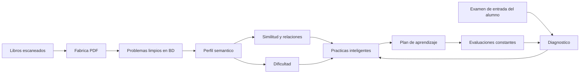
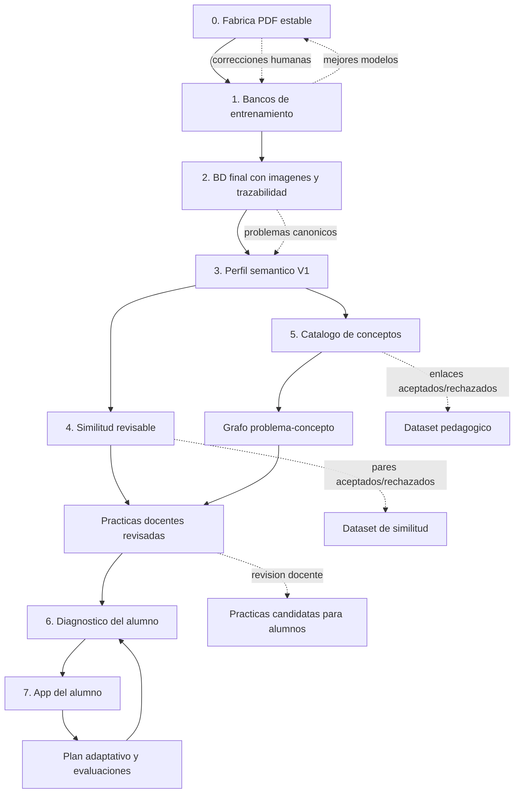
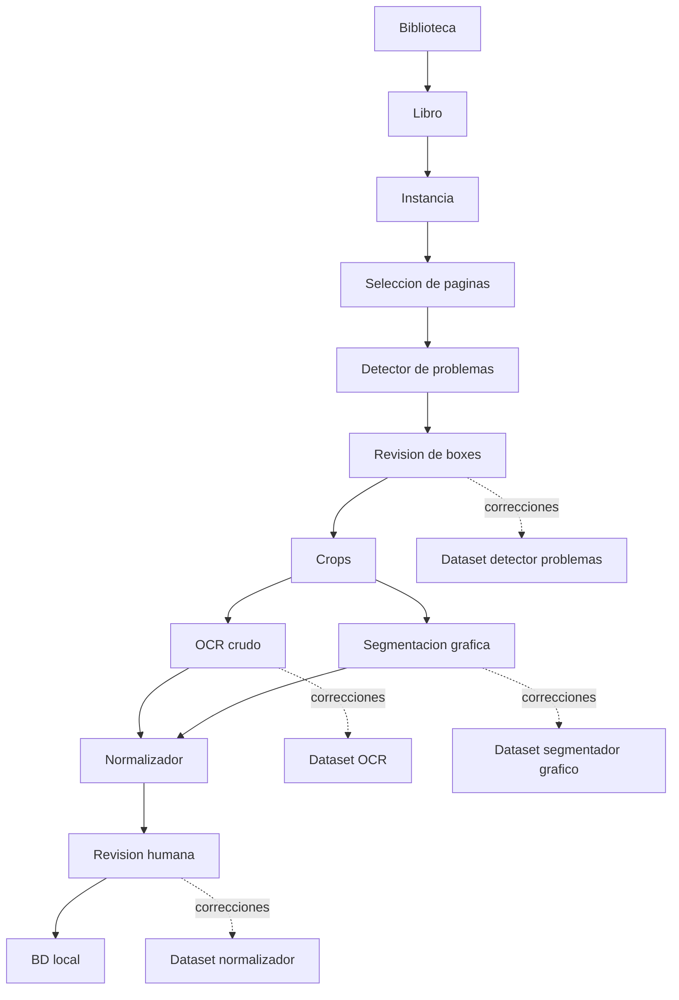
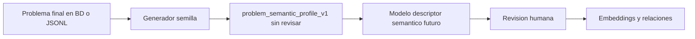
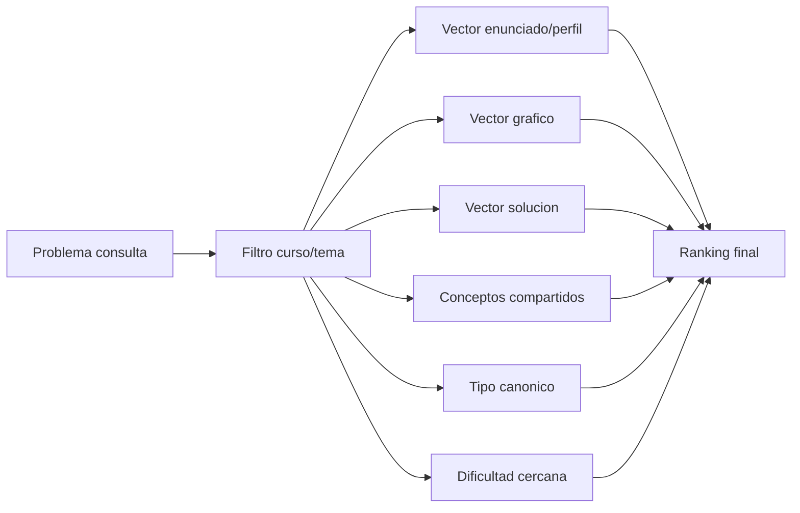
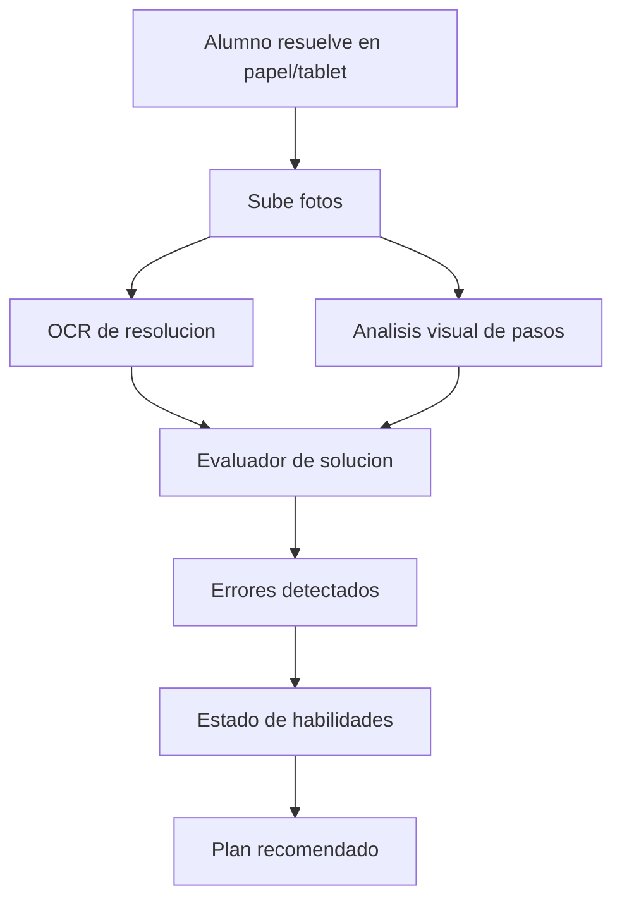

# Plan Maestro: Banco Relacional Y App De Aprendizaje Adaptativo

Fecha: 2026-06-15

## Vision

El objetivo final no es solo escanear libros. El objetivo es construir una base de problemas matematicos que permita entender que conceptos, propiedades, teoremas y habilidades trabaja cada problema, para despues recomendar practicas realmente utiles a cada alumno.

La ruta completa es:



La app debe evolucionar en dos productos conectados:

| Producto | Usuario | Proposito |
| --- | --- | --- |
| Fabrica / Auditor IA | Nosotros / docentes | Extraer, revisar, entrenar modelos y construir la base. |
| App del alumno | Alumno | Diagnosticar nivel, practicar, recibir recomendaciones y medir progreso. |

## Principios

- Primero calidad de datos, despues IA adaptativa.
- Staging antes de BD final.
- Toda correccion humana alimenta entrenamiento.
- La BD final debe ser relacional y semantica, no solo un deposito de LaTeX.
- El problema visible en BD conserva el formato final compatible con Modulo 7.
- La capa semantica vive como tablas adicionales versionadas.
- Los modelos proponen, el humano confirma cuando el dato impacta la base.
- La app de alumnos no debe iniciarse fuerte hasta que tengamos suficientes problemas confiables.

## Donde Estamos Ahora

Foto tomada desde `GET /api/training/status` el 2026-06-15:

| Modelo / banco | Historico | Ciclo actual | Meta por ciclo | Estado |
| --- | ---: | ---: | ---: | --- |
| Segmentacion de problemas | 1075 paginas | 0 | 500 | Hay base historica; ciclo reiniciado. |
| OCR crudo | 481 crops | 0 | 500 | Casi suficiente historico para otro entrenamiento, pero ciclo nuevo esta en cero. |
| Segmentacion de graficos | 43 imagenes corregidas | 0 | 500 | Falta recolectar mucho mas. |
| Normalizador final | 300 problemas | 0 | 500 | Primera version entrenada/probada; falta robustecer. |

Interpretacion:

- Estamos en la fase de construccion de la Fabrica y de los bancos de entrenamiento.
- Ya existe el flujo Biblioteca -> Instancia -> Paginas -> Boxes -> Crops -> OCR -> Segmentos -> Revision -> BD final.
- Ya existe subida a BD local, y la capa semantica relacional inicial ya esta declarada y puede poblarse en modo semilla.
- Ya existe un plan para descriptor semantico en `docs/plan_descriptor_semantico_recomendacion.md`.
- Ya existen contratos JSON validables en `docs/schemas/` para problema, grafico y solucion:
  `problem_semantic_profile_v1`, `geometry_figure_description_v1` y `solution_semantic_profile_v1`.
- `database/schema.sql` declara la primera capa semantica no destructiva: perfiles de problema, graficos, soluciones, conceptos, embeddings y relaciones de similitud.
- Ya existe un generador semilla en `modulos/semantic_profile_seed.py` y CLI en
  `tools/build_semantic_seed_profiles.py`. Este no inventa conceptos profundos:
  solo extrae campos visibles del formato final y deja el perfil en `sin_revisar`.
- Ya existe un generador semilla de graficos en `modulos/semantic_figure_seed.py`,
  conectado al CLI `tools/populate_semantic_seed_profiles.py --kind figure`.
  Este crea el contenedor `geometry_figure_description_v1` por revisar, pero todavia
  no reemplaza al futuro modelo visual que describira puntos, segmentos y medidas.
- Ya existe un generador semilla de relaciones en `modulos/semantic_similarity_seed.py`,
  conectado al CLI `tools/populate_semantic_similarity_edges.py`. Este compara
  perfiles de problema, grafico y solucion, y puede poblar `problem_similarity_edges`
  en modo revisable sin depender todavia de embeddings locales.
- Ya existe plan de ciclo de entrenamiento en `docs/plan_ciclo_entrenamiento_modelos.md`.
- El siguiente salto no es hacer todavia la app del alumno; es convertir la BD final en una base consultable por conceptos, similitud y dificultad.

## Mapa Visual De Etapas E Ideas Actuales

Este mapa resume la ruta actual. La idea central es avanzar desde extraccion
confiable hasta una BD pedagogica que pueda recomendar practicas con sentido.



Lectura rapida:

| Bloque | Idea | Estado actual |
| --- | --- | --- |
| Fabrica PDF | Extraer problemas desde libros escaneados con paginas, boxes, OCR y graficos. | En curso y funcional; seguimos estabilizando. |
| Bancos de entrenamiento | Guardar solo correcciones utiles para mejorar detector, OCR, graficos y normalizador. | Activo; meta por ciclo: 500 muestras. |
| BD final | Guardar problemas revisados con imagenes canonicas y origen. | En curso; ya hay subida local. |
| Perfil semantico | Describir que trabaja el problema: conceptos, objetos, dificultad, grafico y solucion. | Iniciado en semilla. |
| Similitud | Encontrar problemas cercanos por enunciado, grafico, solucion, conceptos y dificultad. | Iniciado en semilla con revision humana. |
| Catalogo de conceptos | Saber que propiedad, tecnica o habilidad entrena cada problema. | Iniciado; ya hay navegacion concepto -> problemas y problema -> conceptos. |
| Practicas docentes | Generar borradores revisables antes de usarlos con alumnos. | Iniciado desde similitud. |
| Diagnostico alumno | Medir habilidades debiles desde examen de entrada, idealmente escrito. | Futuro; esperar BD semantica mas confiable. |
| App alumno | Recomendar plan, practica y evaluaciones constantes. | Futuro. |

Principio de avance:

```text
No saltar directo a la app del alumno.
Primero necesitamos problemas limpios, conceptos revisados y similitud confiable.
```

## Arquitectura Objetivo

### Capa 1: Ingestion Y Extraccion

Responsabilidad: convertir libros en problemas limpios.



Estado actual: en curso y funcionando, pero necesita estabilidad y mas datos corregidos.

### Capa 2: BD Final Relacional

Responsabilidad: guardar problemas confirmados y su trazabilidad.

Tablas actuales importantes:

- `problemas`
- `origenes`
- `problema_origen`
- tablas de libros/instancias de Biblioteca
- tablas de temas/subtemas si estan disponibles en la BD

Tablas a agregar para que la BD sea relacional y pedagogica:

| Tabla propuesta | Proposito |
| --- | --- |
| `problema_assets` | Imagenes canonicas por problema: `img-15.png`, continuaciones, graficos. |
| `problem_semantic_profiles` | JSON versionado con conceptos, habilidades, objetos, dificultad inicial. |
| `problem_figure_profiles` | Descripcion versionada de graficos, especialmente Geometria Plana. |
| `solution_semantic_profiles` | Descripcion de una o varias rutas de solucion cuando existan. |
| `problem_embeddings` | Vectores derivados de enunciado, perfil, grafico y solucion; nunca del OCR crudo directo. |
| `conceptos_matematicos` | Catalogo de conceptos, propiedades, teoremas, operaciones y tecnicas. |
| `problema_concepto` | Relacion N:N entre problema y concepto. |
| `problem_similarity_edges` | Pares de problemas cercanos con score y razon. |
| `problem_difficulty_estimates` | Dificultad estimada, version del modelo y revision humana. |

La idea no es meter todo en `problemas`. `problemas` guarda el enunciado final; las relaciones viven alrededor.

### Capa 3: Perfil Semantico

Responsabilidad: convertir un problema limpio en una descripcion pedagogica.

Entrada:

```text
problema final revisado
+ curso / tema / subtema
+ OCR crudo revisado
+ imagenes canonicas
+ segmentacion grafica
+ descripcion del grafico cuando exista
+ solucion revisada cuando exista
+ origen
```

Primer paso operativo:



La semilla es deliberadamente conservadora: curso, tema, clave, imagen, opciones,
objetos visibles por palabras clave y texto para embedding. Las propiedades,
teoremas, ruta de solucion y dificultad real deben venir despues por modelo,
solucion revisada o revision humana.

Salida:

```json
{
  "schema_version": "problem_semantic_profile_v1",
  "course": "Geometria",
  "topic": "Triangulos",
  "concepts": ["angulos", "suma de angulos", "triangulo isosceles"],
  "skills": ["leer grafico", "plantear relacion angular"],
  "solution_concepts": ["suma de angulos", "relaciones en triangulo isosceles"],
  "solution_paths": [
    {
      "path_id": "principal",
      "method": "relaciones_angulares",
      "steps_summary": ["leer angulos del grafico", "plantear relacion", "despejar x"]
    }
  ],
  "canonical_problem_type": "calculo_de_angulo_con_grafico",
  "difficulty": {
    "estimated_level": 2,
    "signals": {
      "requires_graph_reading": true,
      "steps_estimated": 2
    }
  },
  "embedding_text": "Geometria. Triangulos. Calculo de angulo con grafico. Leer relaciones angulares y plantear ecuacion simple."
}
```

Primera version recomendada:

1. Baseline por reglas.
2. Revision humana de perfiles.
3. Modelo pequeno entrenado con perfiles revisados.
4. Embeddings locales desde `embedding_text`.

Regla nueva:

```text
El perfil del problema y el perfil de solucion son capas distintas.
El enunciado dice que se pide; la solucion revela que propiedades realmente se usan.
```

Esto es importante porque dos problemas pueden verse distintos, pero resolverse con la misma propiedad. Tambien puede pasar que dos problemas se vean parecidos, pero requieran estrategias distintas.

### Capa 4: Similitud Y Relaciones

Responsabilidad: responder preguntas como:

- Que problemas son parecidos a este?
- Que problemas usan la misma propiedad?
- Que problemas son una variacion mas facil o mas dificil?
- Que problemas conviene dar antes de este?
- Que problemas se resuelven con la misma estrategia aunque el enunciado sea diferente?
- Que problemas tienen graficos parecidos o condiciones visuales equivalentes?

La similitud debe ser hibrida:



No basta con embeddings. Dos problemas pueden tener texto parecido pero entrenar habilidades distintas. Tambien puede pasar lo inverso: texto distinto, misma propiedad.

La similitud debe tener pesos distintos por curso:

| Curso | Mayor peso inicial | Razon |
| --- | --- | --- |
| Aritmetica | Conceptos, operaciones, tipo de razonamiento | El texto suele describir bien la estructura. |
| Algebra | Forma algebraica, transformaciones, tecnica de solucion | Dos problemas pueden diferir en numeros pero usar el mismo metodo. |
| Geometria | Grafico, condiciones visuales, solucion usada | El enunciado puede ser corto y el grafico contiene la informacion clave. |
| Trigonometria | Identidades, transformaciones, configuracion grafica si existe | La solucion revela la identidad o estrategia usada. |
| Razonamiento matematico | Patron, estrategia, restricciones | La similitud literal suele ser pobre. |

Para Geometria, la proximidad debe combinar:

```text
texto del problema
+ descripcion visible del grafico
+ objetos geometricos
+ condiciones marcadas
+ propiedad usada en la solucion
+ dificultad
```

No debemos pedirle al descriptor de grafico que resuelva. Primero describe lo visible. La solucion revisada o asistida es la capa que indica que propiedad se uso.

Propuesta de scoring inicial:

```text
score_total =
  peso_enunciado * similitud_enunciado
+ peso_grafico * similitud_grafico
+ peso_solucion * similitud_solucion
+ peso_conceptos * conceptos_compartidos
+ peso_tipo * tipo_canonico
+ peso_dificultad * cercania_dificultad
```

Pesos iniciales sugeridos:

| Curso | Enunciado | Grafico | Solucion | Conceptos | Tipo | Dificultad |
| --- | ---: | ---: | ---: | ---: | ---: | ---: |
| Aritmetica | 0.30 | 0.00 | 0.25 | 0.25 | 0.10 | 0.10 |
| Algebra | 0.25 | 0.00 | 0.35 | 0.20 | 0.10 | 0.10 |
| Geometria | 0.15 | 0.30 | 0.30 | 0.15 | 0.05 | 0.05 |
| Trigonometria | 0.20 | 0.10 | 0.35 | 0.20 | 0.10 | 0.05 |

Esto debe ser ajustable con datos reales y revision humana.

Implementacion semilla actual:

```powershell
python tools\populate_semantic_seed_profiles.py --kind all --profile local_mirror --limit 200 --apply
python tools\populate_semantic_similarity_edges.py --profile local_mirror --limit 200 --top-k 5 --threshold 0.15
python tools\populate_semantic_similarity_edges.py --profile local_mirror --limit 200 --top-k 5 --threshold 0.15 --apply
```

Reglas de esta primera version:

- No escribe nada si no se usa `--apply`.
- Lee `problem_semantic_profiles`, `problem_figure_profiles` y `solution_semantic_profiles`.
- Calcula componentes separados: enunciado, grafico, solucion, conceptos, tipo canonico y dificultad.
- Ajusta pesos por curso; en Geometria da mas peso a grafico y solucion.
- Guarda explicacion humana en `reason` y desglose en `score_components`.
- Todo queda `sin_revisar`, porque el objetivo es crear candidatos para evaluacion docente.

Consulta revisable desde la Biblioteca/API:

```text
GET /api/library/problems/{problem_id}/similar?db_name=mathcontentstudio_local_mirror&top_k=10
```

Respuesta: `problem_similarity_review_v1`, con problema base, lista de similares,
score, razon, componentes y estado de revision. Esta ruta es solo lectura; se
alimenta de `problem_similarity_edges`.

Estado de la base semantica desde Biblioteca/API:

```text
GET /api/library/semantic/status?db_name=mathcontentstudio_local_mirror
```

Respuesta: `semantic_coverage_status_v1`, con conteos de problemas, perfiles de
problema, perfiles de grafico, perfiles de solucion, embeddings y relaciones.
Sirve para ubicarnos en la etapa actual antes de recomendar problemas:

- `profiles_pending`: faltan perfiles semanticos por generar.
- `edges_pending`: faltan relaciones de similitud.
- `review_ready`: ya hay relaciones para revisar desde la UI.

Esta ruta tambien es solo lectura. No genera perfiles ni relaciones; solo muestra
avance y siguiente paso.

Revision humana de relaciones:

```text
POST /api/library/problems/{problem_id}/similar/{similar_problem_id}/review?db_name=mathcontentstudio_local_mirror
```

Payload:

```json
{
  "status": "aceptado | rechazado | dudoso | sin_revisar",
  "review_note": "opcional"
}
```

La revision se guarda en `problem_similarity_edges.status`,
`human_verified`, `review_note` y `reviewed_at`. Esta senal es fundamental para
mejorar el recomendador: los pares aceptados son ejemplos positivos y los pares
rechazados son ejemplos negativos para ajustar pesos, embeddings o entrenar un
modelo de similitud posterior. No modifica `problemas`.

Exportacion de feedback para entrenamiento/evaluacion:

```powershell
python tools\export_semantic_similarity_feedback.py `
  --profile local_mirror `
  --output-jsonl .cache\transcriptor_runs\datasets\semantic_similarity_feedback\feedback.jsonl
```

Salida:

- `feedback.jsonl`: un ejemplo por relacion revisada, con `label` positivo,
  negativo o dudoso, problema origen, problema candidato, score, componentes,
  razon y texto combinado `pair_text`.
- `manifest.json`: conteos por etiqueta y estado.

Uso posterior:

- pares `positive`: enseñar al modelo que dos problemas realmente comparten
  concepto/propiedad/ruta;
- pares `negative`: enseñar falsos positivos;
- pares `uncertain`: cola para una segunda revision o validacion con otro
  docente.

Borrador de practica desde un problema semilla:

```text
GET /api/library/problems/{problem_id}/practice-draft?db_name=mathcontentstudio_local_mirror&target_count=10
```

Respuesta: `semantic_practice_draft_v1`.

Esta primera version no reemplaza al motor adaptativo futuro. Sirve como puente
docente: toma el problema semilla, prioriza relaciones aceptadas por humano,
excluye relaciones rechazadas y arma una secuencia inicial de refuerzo con
roles como `refuerzo_validado`, `refuerzo_directo`, `practica_guiada` o
`extension`.

Ademas de la lista estructurada, la respuesta incluye `practice_latex_items` y
`practice_latex`. Ese bloque usa `\item[\textbf{n.}]` renumerado y queda listo
para copiarlo al flujo de revision/exportacion tipo Modulo 7, siempre con
revision docente antes de usarlo con alumnos.

Guardado del borrador docente:

```text
POST /api/library/problems/{problem_id}/practice-draft?db_name=mathcontentstudio_local_mirror
```

Entrada: el `semantic_practice_draft_v1` generado por la app. Se persiste en
`semantic_practice_drafts` con JSON completo, LaTeX final, estado `borrador` y
modelo usado. Esto no modifica `problemas`: solo conserva la recomendacion para
revision docente y uso posterior.

Estados docentes del borrador:

| Estado | Uso |
| --- | --- |
| `borrador` | Practica sugerida, todavia no validada. |
| `revisado` | Practica validada por docente; puede usarse como candidata para alumnos. |
| `descartado` | Practica generada pero no util; queda como evidencia negativa del recomendador. |

Lectura de borradores guardados:

```text
GET /api/library/problems/{problem_id}/practice-drafts?db_name=mathcontentstudio_local_mirror
```

Respuesta: `semantic_practice_draft_list_v1`. Permite recuperar practicas
guardadas para el problema semilla, cargar de nuevo su JSON/LaTeX y continuar la
revision sin recalcular la recomendacion.

Para consumo futuro por la app del alumno se debe filtrar:

```text
GET /api/library/problems/{problem_id}/practice-drafts?db_name=mathcontentstudio_local_mirror&status=revisado
```

Cuando la app del alumno no parte de un problema semilla concreto, debe usar el
catalogo global revisado:

```text
GET /api/library/practice-drafts?db_name=mathcontentstudio_local_mirror&status=revisado
```

Respuesta: `semantic_practice_draft_catalog_v1`. Devuelve solo borradores
docentes ya guardados y filtrables por estado; en modo alumno el estado por
defecto debe ser `revisado`.

La pantalla docente puede ver todos los estados, pero la capa de alumno solo
debe considerar practicas `revisado`.

Uso esperado:

1. Consultar problemas similares.
2. Marcar pares como aceptados, rechazados o dudosos.
3. Crear borrador de practica.
4. Guardar el borrador docente.
5. Marcar el borrador como revisado o descartado.
6. Usar solo borradores revisados con alumnos.

### Capa 5: Diagnostico Del Alumno

Responsabilidad: entender el nivel del alumno a partir de un examen de entrada, idealmente escrito.

Flujo futuro:



Tipos de errores que debemos detectar:

| Tipo de error | Ejemplo |
| --- | --- |
| Conceptual | Usa una propiedad que no corresponde. |
| Procedimental | Sabe la idea pero opera mal. |
| Lectura grafica | Lee mal un angulo, segmento o dato del diagrama. |
| Algebraico | Despeje, signos, fracciones, potencias. |
| Estrategia | No reconoce que tecnica aplicar. |
| Notacion | Escribe relaciones ambiguas o incompletas. |

Primera version sin modelo fuerte:

- examen diagnosticado con problemas ya conocidos de la BD;
- respuestas del alumno capturadas como imagen;
- revision humana asistida;
- clasificacion manual/semiautomatica de error;
- actualizacion de `student_skill_state`.

### Capa 6: Recomendador Y Plan De Aprendizaje

Responsabilidad: construir una secuencia de practica que lleve al alumno desde su nivel actual al objetivo.

Entrada:

```json
{
  "student_id": "S1",
  "weak_skills": ["leer grafico", "plantear ecuacion angular"],
  "current_level": 2,
  "target_course": "Geometria",
  "recent_errors": ["lectura_grafica", "relacion_angular"]
}
```

Salida:

```json
{
  "sequence": [
    {"purpose": "refuerzo directo", "difficulty": 1},
    {"purpose": "variacion cercana", "difficulty": 2},
    {"purpose": "transferencia", "difficulty": 3},
    {"purpose": "evaluacion corta", "difficulty": 2}
  ]
}
```

Regla pedagogica central:

```text
No recomendar solo problemas parecidos.
Recomendar una progresion: requisito -> refuerzo -> variacion -> reto -> evaluacion.
```

## Modelo De Datos Propuesto

```mermaid
erDiagram
  problemas ||--o{ problema_origen : tiene
  origenes ||--o{ problema_origen : describe
  problemas ||--o{ problema_assets : usa
  problemas ||--|| problem_semantic_profiles : perfil
  problemas ||--o{ problem_figure_profiles : graficos
  problemas ||--o{ solution_semantic_profiles : soluciones
  problemas ||--o{ problem_embeddings : vector
  problemas ||--o{ problema_concepto : entrena
  conceptos_matematicos ||--o{ problema_concepto : aparece_en
  problemas ||--o{ problem_similarity_edges : origen
  problemas ||--o{ problem_similarity_edges : destino
  alumnos ||--o{ student_problem_attempts : resuelve
  problemas ||--o{ student_problem_attempts : usado_en
  alumnos ||--o{ student_skill_state : domina
  conceptos_matematicos ||--o{ student_skill_state : habilidad
  alumnos ||--o{ practice_plans : recibe
```



### Tabla: `conceptos_matematicos`

Campos sugeridos:

- `id`
- `codigo`
- `nombre`
- `tipo`: `concepto`, `propiedad`, `teorema`, `operacion`, `tecnica`
- `curso`
- `tema`
- `subtema`
- `descripcion`
- `prerequisitos_json`
- `estado`: `activo`, `candidato`, `rechazado`

### Tabla: `problema_concepto`

Campos sugeridos:

- `problema_id`
- `concepto_id`
- `role`: `concept`, `skill`, `solution_concept`, `solution_method`, `property`, `figure_type`
- `confidence`
- `source`: `problem_semantic_profile`, `solution_semantic_profile`, `problem_figure_profile`
- `reviewed`: `false` hasta revision humana

### Tabla: `problem_semantic_profiles`

Campos sugeridos:

- `problema_id`
- `schema_version`
- `profile_json`
- `embedding_text`
- `model_version`
- `review_status`
- `created_at`
- `updated_at`

### Tabla: `problem_figure_profiles`

Campos sugeridos:

- `id`
- `problema_id`
- `asset_id`
- `schema_version`
- `figure_profile_json`
- `embedding_text`
- `model_version`
- `review_status`

Uso:

```text
Describir lo visible del grafico: puntos, segmentos, marcas, angulos,
paralelismos marcados, etiquetas, arcos, circunferencias y advertencias.
No resolver el problema desde la imagen.
```

### Tabla: `solution_semantic_profiles`

Campos sugeridos:

- `id`
- `problema_id`
- `schema_version`
- `solution_path_id`
- `solution_profile_json`
- `embedding_text`
- `source`: `humano`, `modelo`, `solucionario`, `mixto`
- `review_status`

Un problema puede tener varias soluciones:

```json
[
  {
    "solution_path_id": "principal",
    "method": "relaciones_angulares",
    "concepts_used": ["suma de angulos", "triangulo isosceles"],
    "skills_used": ["leer grafico", "plantear ecuacion"]
  },
  {
    "solution_path_id": "alternativa_1",
    "method": "construccion_auxiliar",
    "concepts_used": ["angulo exterior", "trazo auxiliar"]
  }
]
```

La solucion no reemplaza el enunciado. Sirve para saber que propiedad o camino realmente conecta este problema con otros.

### Tabla: `student_problem_attempts`

Campos sugeridos:

- `student_id`
- `problema_id`
- `practice_id`
- `answer`
- `is_correct`
- `time_seconds`
- `solution_image_path`
- `error_profile_json`
- `review_status`

### Tabla: `student_skill_state`

Campos sugeridos:

- `student_id`
- `concepto_id`
- `mastery_score`: 0 a 1
- `evidence_count`
- `last_seen_at`
- `weakness_reason`
- `next_review_at`

## Fases De Ejecucion

### Fase 0: Estabilizar Fabrica Actual

Objetivo: que extraer problemas sea confiable y rapido.

Entregables:

- selector de paginas estable;
- boxes sincronizados con crops/OCR;
- imagenes canonicas correctas en BD;
- normalizador local usable;
- errores copiables y visibles por instancia;
- tests de staging/BD/normalizador.

Estado: en curso, bastante avanzado.

### Fase 1: Completar Bancos De Entrenamiento

Objetivo: mejorar los modelos base antes de construir inteligencia encima.

Prioridad:

1. Segmentacion de problemas.
2. OCR crudo.
3. Normalizador final.
4. Segmentacion de graficos.

Acciones:

- recolectar correcciones reales;
- llegar a 500 muestras por ciclo;
- evaluar champion/challenger;
- actualizar modelo solo si mejora;
- conservar hard errors.

Estado: activo.

### Fase 2: BD Final Con Imagenes Y Trazabilidad

Objetivo: cada problema subido debe quedar listo para practica y para perfil semantico.

Entregables:

- `problemas` con formato final correcto;
- `db_images` con nombres canonicos;
- origen estructurado;
- validacion para Modulo 7;
- reporte de subida a BD.

Estado: en curso.

### Fase 3: Perfil Semantico V1

Objetivo: crear `problem_semantic_profile_v1` para problemas ya revisados.

Entregables:

- tabla `problem_semantic_profiles`;
- generador baseline por reglas;
- UI simple para revisar perfil;
- 100 perfiles revisados manualmente;
- exportador de dataset semantico.

Estado: planificado; es el siguiente gran bloque despues de estabilizar BD.

### Fase 4: Busqueda Por Similitud

Objetivo: encontrar problemas cercanos por concepto, habilidad y dificultad.

Entregables:

- embeddings locales;
- vectores separados para enunciado/perfil, grafico y solucion;
- tabla `problem_embeddings`;
- endpoint `buscar similares`;
- vista interna para comparar resultados;
- pesos de similitud configurables por curso;
- evaluacion manual de top-k.

Estado: iniciado en version semilla. Ya existe poblador de `problem_similarity_edges`
sin embeddings reales; falta vista interna, evaluacion humana de top-k y reemplazar/mezclar
el score semilla con embeddings locales.

### Fase 5: Catalogo De Conceptos Y Grafo Pedagogico

Objetivo: que la BD sepa que propiedad o habilidad entrena cada problema.

Entregables:

- catalogo de conceptos;
- relaciones problema-concepto;
- conceptos usados por solucion y por camino alternativo;
- prerequisitos entre conceptos;
- revision humana de candidatos;
- soporte para "problemas que trabajan la misma propiedad".

Estado: iniciado en version semilla. Ya existe poblador de grafo desde perfiles:

```powershell
python tools\populate_semantic_seed_profiles.py --kind concept --profile local_mirror --limit 200
python tools\populate_semantic_seed_profiles.py --kind concept --profile local_mirror --limit 200 --apply
```

Reglas de esta primera version:

- Lee `problem_semantic_profiles`, `solution_semantic_profiles` y `problem_figure_profiles`.
- Crea conceptos con `estado=pendiente`.
- Crea relaciones `problema_concepto` con `reviewed=false`.
- No valida todavia que el concepto sea definitivo; solo deja candidatos revisables.
- La revision docente ya puede validar, marcar dudosa o rechazar una relacion problema-concepto.
- La revision docente futura todavia debe fusionar duplicados, corregir nombres y aprobar conceptos del catalogo.

Consulta desde Biblioteca/API:

```text
GET /api/library/concepts?db_name=mathcontentstudio_local_mirror&q=triang&course=Geometria
```

Respuesta: `semantic_concept_catalog_v1`. Devuelve conceptos con curso, tema,
tipo, estado, cantidad de problemas enlazados y cantidad de enlaces revisados.
La UI de Biblioteca ya tiene la vista `Conceptos` para explorar este catalogo.

Consulta de problemas enlazados a un concepto:

```text
GET /api/library/concepts/{concept_id}/problems?db_name=mathcontentstudio_local_mirror
```

Respuesta: `semantic_concept_linked_problems_v1`. Devuelve el concepto, los
problemas vinculados y el estado del enlace: `sin_revisar`, `aceptado`,
`dudoso` o `rechazado`.

Revision humana del enlace:

```text
POST /api/library/concepts/{concept_id}/problems/{problem_id}/review?db_name=mathcontentstudio_local_mirror
```

Payload minimo:

```json
{
  "role": "concept",
  "status": "aceptado"
}
```

Respuesta: `semantic_concept_link_review_v1`. Esta revision alimenta la base
pedagogica: los enlaces aceptados son evidencia positiva, los rechazados son
evidencia negativa y los dudosos quedan para auditoria posterior.

Consulta inversa desde un problema:

```text
GET /api/library/problems/{problem_id}/concepts?db_name=mathcontentstudio_local_mirror
```

Respuesta: `semantic_problem_concept_links_v1`. Devuelve el problema base y
sus conceptos/propiedades/tecnicas vinculadas con estado de revision,
confianza y fuente. La vista `Similitud` ya muestra estos enlaces junto al
problema base para explicar por que ese problema pertenece a cierto grupo
pedagogico antes de generar practicas.

### Fase 6: Diagnostico Del Alumno

Objetivo: medir nivel inicial del alumno.

Entregables:

- evaluaciones diagnosticas generadas desde la BD;
- captura de respuesta escrita;
- revision asistida de errores;
- `student_skill_state`;
- reporte de fortalezas/debilidades.

Estado: futuro; no conviene acelerar hasta tener una BD semantica util.

### Fase 7: App Del Alumno

Objetivo: practicar, recibir plan y medir progreso.

Entregables:

- login/perfil del alumno;
- evaluacion de entrada;
- practicas recomendadas;
- historial de intentos;
- tablero de progreso;
- plan semanal adaptativo.

Estado: futuro.

## Que Conviene Acelerar Y Que Conviene Esperar

### Acelerar Ahora

- Extraccion de problemas desde libros.
- Normalizador final y guardado en BD.
- Correccion de imagenes canonicas.
- Bancos de entrenamiento por modelo.
- Primer contrato semantico y pruebas manuales.

### Esperar Un Poco

- App final para alumnos.
- Analisis automatico completo de resoluciones escritas.
- Motor complejo de recomendacion.
- Examenes mixtos de admision.
- Problema vs solucion.

Motivo:

```text
Sin una BD limpia y semantica, la app del alumno solo tendria problemas sueltos.
Con una BD semantica, la app puede explicar por que recomienda cada practica.
```

## Primer MVP Realista

MVP interno:

```text
Fabrica estable
-> subir 500-1000 problemas revisados a BD
-> generar perfil semantico baseline
-> buscar problemas similares
-> generar practica por tema/habilidad
```

MVP alumno:

```text
diagnostico corto
-> detectar habilidades debiles manual/asistido
-> recomendar secuencia de 10 problemas
-> registrar aciertos/errores
-> ajustar siguiente practica
```

## Metricas Del Proyecto

### Calidad De Extraccion

- porcentaje de paginas sin correccion de boxes;
- porcentaje de crops con OCR usable;
- tasa de errores por instancia;
- tiempo promedio por problema revisado;
- porcentaje de problemas que llegan a BD sin retrabajo.

### Calidad De Normalizacion

- render LaTeX correcto;
- alternativas completas;
- clave no inventada;
- imagen correcta;
- `[CONT.]` fusionado correctamente;
- distancia de edicion humana.

### Calidad Semantica

- conceptos correctos;
- habilidades correctas;
- dificultad razonable;
- top-5 similares aceptados por humano;
- duplicados/variantes detectados.

### Calidad Pedagogica

- mejora de acierto por habilidad;
- reduccion de errores repetidos;
- tiempo hasta dominar una habilidad;
- retencion en evaluaciones posteriores;
- satisfaccion del alumno/docente.

## Proximos Pasos Concretos

1. Mantener la Fabrica como prioridad hasta que la subida a BD sea confiable.
2. Subir un primer bloque amplio de problemas normales a la BD local.
3. Ejecutar un primer `dry-run` y luego `--apply` controlado para poblar `problem_semantic_profiles`.
4. Enriquecer `problem_figure_profiles` con descripciones de graficos revisadas o generadas por modelo visual.
5. Crear generador equivalente para `solution_semantic_profiles` cuando existan soluciones revisadas.
6. Ejecutar `tools/populate_semantic_similarity_edges.py` en dry-run para los primeros bloques.
7. Crear vista interna: "problemas similares" para evaluar manualmente el top-k.
8. Elegir embedding local inicial.
9. Revisar catalogo inicial de conceptos para Algebra, Aritmetica y Geometria.
10. Recien despues disenar el primer diagnostico del alumno.

## Decision Guia

La etapa actual del proyecto es:

```text
Fase 0 / Fase 1 / Fase 2:
estabilizar extraccion, entrenar modelos base y consolidar BD final.
```

La siguiente etapa importante sera:

```text
Fase 3:
perfil semantico revisable para problemas ya guardados.
```

La app del alumno debe construirse cuando ya podamos responder con confianza:

```text
Dado este problema, que conceptos trabaja, que problemas se parecen,
que dificultad tiene y que problema conviene dar despues?
```
