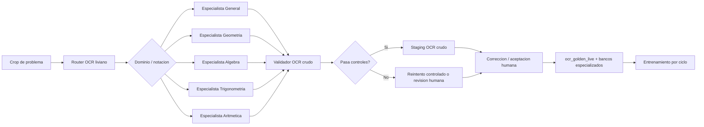
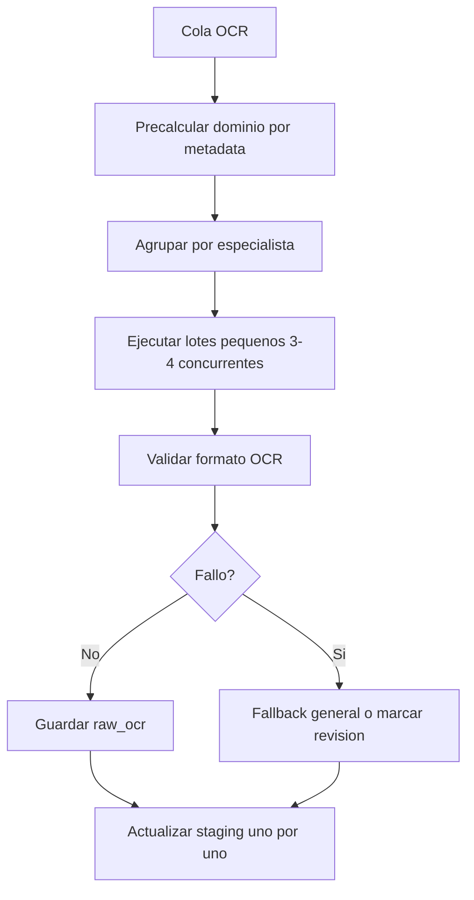

# Plan OCR Con Especialistas Por Notacion

Fecha: 2026-06-15

## Objetivo

Entrenar y operar el modelo OCR mas importante del flujo:

```text
imagen crop del problema -> OCR crudo fiel en formato de escaneo
```

El OCR no debe normalizar, resolver ni describir graficos. Su salida debe ser texto fiel, revisable y util para el normalizador posterior.

## Decision Principal

No conviene implementar varios agentes LLM conversando entre si durante cada OCR. Eso aumenta costo, latencia y puntos de falla.

La arquitectura recomendada es:

```text
router liviano -> especialista OCR -> validadores -> revision humana -> banco de entrenamiento
```

En la practica, cada "especialista" debe ser una combinacion de:

- clasificador barato de dominio;
- prompt/politica OCR especifica;
- adaptador LoRA especializado cuando haya suficientes muestras;
- validadores de formato y notacion;
- reglas de reintento solo si la salida falla.

## Arquitectura



## Router OCR

El router no debe ser un modelo pesado en V1. Debe decidir con señales disponibles:

- libro, instancia, curso y tema si existen;
- texto visible de portada o metadata de biblioteca;
- presencia de grafico desde segmentacion;
- patrones simples del crop si ya hay OCR candidato;
- historial de errores por instancia.

Salida del router:

```json
{
  "domain": "geometria",
  "specialist": "geometry_ocr_v1",
  "notation_flags": ["diagram_labels", "angles", "options_ae"],
  "confidence": 0.82,
  "fallback": "general_ocr_v1"
}
```

Regla practica:

- si `confidence >= 0.70`, usar especialista;
- si no, usar especialista general;
- si el validador falla, probar fallback general o enviar a revision.

## Especialistas Iniciales

### 1. General

Uso:

- problemas sin dominio claro;
- libros mixtos;
- casos con poca muestra por tema.

Debe aprender el formato base:

```text
<01.> Enunciado... A) ... B) ... C) ... D) ... E) ...
[CONT.] ...
```

### 2. Geometria

Prioridad alta.

Debe manejar:

- letras de vertices: `A`, `B`, `C`, `P`, `Q`, `R`;
- angulos: `x^\circ`, `50^\circ`, `m\sphericalangle ABC`;
- segmentos: `AB`, `BC`, `PQ`;
- paralelismo/perpendicularidad: `AB \parallel CD`, `AB \perp CD`;
- triangulos, circunferencias, cuadrilateros;
- texto que acompaña graficos sin describir el dibujo.

Regla:

```text
Si hay grafico, el OCR transcribe lo visible y conserva la indicacion textual.
No inventa relaciones del grafico que no esten escritas.
```

Regla critica de notacion angular:

```text
En contexto de geometria, el simbolo impreso de angulo debe entrenarse como
\sphericalangle.
No debe convertirse en <, \lt ni \leq, salvo que la imagen muestre una
desigualdad real.
```

### 3. Algebra

Debe manejar:

- ecuaciones;
- polinomios;
- factorizacion;
- matrices;
- sistemas;
- fracciones con `\frac` o `dfrac` segun politica del formato OCR vigente.

### 4. Trigonometria

Debe manejar:

- `\sin`, `\cos`, `\tan`, `\cot`;
- angulos notables;
- radianes y grados;
- identidades.

### 5. Aritmetica

Debe manejar:

- razones y proporciones;
- porcentajes;
- divisibilidad;
- sucesiones numericas;
- conteo y operaciones con enteros.

## Datos De Entrenamiento

Fuente actual:

- `ocr_golden_live`;
- `ocr_geometry_golden_live`;
- staging con `trace.last_raw_ocr_review.source` humano;
- aceptaciones por lote: `human_raw_ocr_batch_acceptance`.

Cada muestra OCR debe guardar metadata adicional:

```json
{
  "schema_version": "ocr_specialist_sample_v1",
  "domain": "geometria",
  "specialist_hint": "geometry_ocr_v1",
  "notation_flags": ["angles", "diagram_labels", "options_ae"],
  "raw_candidate": "<salida del modelo antes de corregir>",
  "corrected_text": "<salida humana>",
  "error_types": ["latex_symbol", "option_missing"],
  "source": {
    "book_code": "...",
    "instance_type": "...",
    "record_id": "...",
    "crop_path": "..."
  }
}
```

## Estrategia De Entrenamiento

### Fase 0: Baseline

Crear dataset OCR local:

```powershell
python tools/prepare_local_ocr_lab_dataset.py `
  --out-dir .cache/transcriptor_runs/datasets/local_ocr_lab_full `
  --staging-root .cache/transcriptor_runs/staging
```

Evaluar modelo actual:

```powershell
python tools/evaluate_local_ocr_dataset.py `
  --dataset-dir .cache/transcriptor_runs/datasets/local_ocr_lab_full `
  --split test `
  --hide-results
```

### Fase 1: Modelo General OCR

Entrenar un LoRA general con todo el dataset revisado.

```powershell
python tools/train_local_ocr_lora.py `
  --dataset-dir .cache/transcriptor_runs/datasets/local_ocr_lab_full `
  --output-dir models/local_ocr/general_qwen2_5_vl_3b_lora_v1 `
  --epochs 1 `
  --max-train-samples 500 `
  --max-eval-samples 100
```

Este modelo solo se activa si supera al champion en el test fijo.

### Fase 2: Especialista Geometria

Entrenar primero Geometria porque es donde hay mas notacion visual y mas riesgo de error.

Requisito minimo recomendado:

```text
200 muestras de geometria para smoke
500 muestras para ciclo formal
```

### Fase 3: Especialistas Restantes

Crear especialistas solo si cumplen:

- al menos 200 muestras utiles del dominio;
- errores repetidos del modelo general;
- mejora medible en test del dominio;
- sin regresion grave en test general.

## Metricas

Metricas globales:

- `cer`: bajar;
- `wer`: bajar;
- `format_pass_rate`: subir;
- `prefix_ok_rate`: subir;
- `option_label_accuracy`: subir;
- `angle_symbol_accuracy`: subir, especialmente contra confusiones `\sphericalangle` -> `<` o `\leq`;
- `hallucination_rate`: bajar;
- `empty_or_failed_rate`: bajar;
- `human_ocr_edit_distance`: bajar.

Metricas por especialista:

| Dominio | Metricas criticas |
| --- | --- |
| Geometria | angulos, vertices, segmentos, etiquetas de grafico, alternativas |
| Algebra | ecuaciones, fracciones, exponentes, signos |
| Trigonometria | funciones trigonometricas, grados/radianes, identidades |
| Aritmetica | numeros, proporciones, porcentajes, operaciones |

Regla de activacion:

```text
Un especialista no reemplaza al general.
Se usa solo si mejora su dominio y mantiene fallback confiable.
```

## Flujo De Inferencia Optimizado



Optimizaciones:

- agrupar por especialista antes de llamar al modelo;
- no cargar/adaptar LoRA por cada imagen individual;
- procesar en lotes pequenos;
- reducir imagen antes de inferencia si excede limites;
- guardar resultado registro por registro;
- apagar endpoint solo cuando no queden jobs activos.

## Implementacion Recomendada En La App

### Cambios V1

1. Agregar metadata de dominio a muestras OCR.
2. Permitir etiquetar dominio desde Biblioteca/libro/instancia.
3. Aceptar `human_raw_ocr_batch_acceptance` como muestra entrenable.
4. Exportar datasets filtrados por dominio:

```powershell
python tools/prepare_local_ocr_lab_dataset.py `
  --out-dir .cache/transcriptor_runs/datasets/local_ocr_geometry `
  --domain geometria
```

5. Agregar evaluacion por dominio.
6. Activar router simple:

```text
metadata -> especialista -> fallback general
```

### Cambios V2

1. Entrenar LoRA general.
2. Entrenar LoRA de Geometria.
3. Comparar champion/challenger por dominio.
4. Activar especialista solo para dominio aprobado.

### Cambios V3

1. Especialistas de Algebra, Trigonometria y Aritmetica.
2. Hard-errors por dominio.
3. Reentrenamiento por ciclos de 500 muestras.

## Riesgos

| Riesgo | Mitigacion |
| --- | --- |
| Muchos especialistas con pocas muestras | empezar con general + geometria |
| Router equivocado | fallback general y revision humana |
| Mayor costo por cambiar adaptadores | agrupar cola por especialista |
| Sobreajuste por tema | mantener test fijo por libro/instancia no visto |
| Alucinaciones | validar contra formato OCR y penalizar texto inventado |

## Orden Recomendado

1. Mantener OCR crudo como objetivo unico.
2. Mejorar dataset y metadata.
3. Evaluar baseline actual.
4. Entrenar OCR general.
5. Entrenar especialista Geometria.
6. Agregar router/fallback.
7. Expandir a otros especialistas solo con evidencia.

Esta ruta es mas rapida que crear agentes complejos y permite llegar antes a mejoras medibles.
