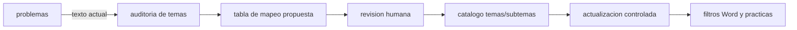

# Plan de reorganizacion de cursos y temas en BD

## Objetivo

Unificar los valores de `curso`, `tema` y, mas adelante, `subtema` para que:

- los filtros del modulo Word sean claros;
- las practicas se generen por tema real, no por nombres de semana;
- el normalizador use un catalogo estable;
- las futuras inserciones desde Fabrica apunten a temas aprobados.

La migracion debe ser reversible y revisable. No se debe actualizar masivamente `problemas` sin una tabla de mapeo aprobada.

## Diagnostico actual

BD revisada: `mathcontentstudio_local_mirror`.

Total actual: `9769` problemas.

Columnas disponibles en `problemas`:

- `curso`
- `tema`
- `subtema`
- `tema_id`
- `subtema_id`

Tablas catalogo actuales:

- `temas`: no existe.
- `subtemas`: no existe.
- `cursos`: no existe.

Esto significa que la app trabaja ahora con texto directo desde `problemas`.

Problemas detectados:

- Cursos duplicados por forma:
  - `Algebra`
  - `�lgebra`
  - `Geometria`
  - `geometria`
  - `Geometria del espacio`
  - `Geometria del Espacio`
  - `Geometr�a del Espacio`
- Temas duplicados por mayusculas/minusculas:
  - `Productos Notables` / `Productos notables`
  - `Teoria de Grados` / `Teoria de grados`
  - `Proporcionalidad de Segmentos` / `proporcionalidad de segmentos`
  - `Semejanza de Triangulos` / `semejanza de triangulos`
- Temas con codificacion rota:
  - `Radicaci�n`
  - `Factorizaci�n`
  - `tri�ngulos`
  - `acut�ngulo`
- Temas que no son temas, sino sesiones:
  - `semana_1_tri_ngulos`
  - `semana_10_proporcionalidad_de_segmentos`
  - `semana_16_reas_de_regiones_triangulares`
- `subtema` esta vacio en todos los registros revisados.

## Taxonomia base propuesta

### Cursos canonicos

Usar nombres sin tildes para evitar problemas de codificacion en filtros y scripts:

- `Algebra`
- `Geometria`
- `Geometria del Espacio`
- `Trigonometria`
- `Aritmetica`
- `Razonamiento Matematico`
- `Estadistica`
- `Geometria Analitica`

### Temas canonicos iniciales por curso

#### Algebra

- Conceptos Basicos
- Expresiones Algebraicas
- Valor Numerico
- Productos Notables
- Cocientes Notables
- Division Algebraica
- Factorizacion
- Radicacion
- Polinomios
- Polinomios Especiales
- Teoria de Grados
- Binomio de Newton
- Combinatoria
- Factorial
- Sumatorias
- Numeros Complejos
- Intervalos
- Desigualdades
- Ecuaciones Lineales
- Ecuaciones Cuadraticas
- Ecuaciones de Grado Superior
- Ecuaciones Exponenciales
- Sistemas de Ecuaciones Lineales
- Sistemas de Ecuaciones No Lineales
- Inecuaciones Lineales
- Inecuaciones Cuadraticas
- Inecuaciones Polinomiales
- Inecuaciones Racionales
- Inecuaciones Irracionales
- Inecuaciones Exponenciales
- Sistemas de Inecuaciones
- Funciones

#### Geometria

- Segmentos
- Angulos
- Angulos entre Rectas Paralelas
- Triangulos
- Clasificacion de Triangulos
- Lineas Notables
- Congruencia de Triangulos
- Aplicaciones de Congruencia
- Semejanza de Triangulos
- Proporcionalidad de Segmentos
- Relaciones Metricas
- Relaciones Metricas en el Triangulo Rectangulo
- Trazos Auxiliares
- Desigualdades Geometricas
- Cuadrilateros
- Cuadrilatero Inscrito e Inscriptible
- Poligonos
- Poligonos Regulares
- Circunferencias
- Posiciones Relativas entre Circunferencias
- Relaciones Metricas en la Circunferencia
- Areas de Regiones
- Areas de Regiones Triangulares
- Areas de Regiones Cuadrangulares
- Areas de Regiones Circulares
- Regiones Convexas

#### Geometria del Espacio

- Rectas y Planos
- Angulos Diedros
- Angulos Triedros
- Poliedros
- Poliedros Regulares
- Prismas
- Piramide
- Cilindro
- Cono
- Esfera
- Esfera y Pappus

#### Trigonometria

- Sistemas de Medidas Angulares
- Angulo Trigonometrico
- Angulos en Posicion Normal
- Reduccion al Primer Cuadrante
- Razones Trigonometricas de Angulos Agudos
- Circunferencia Trigonometrica
- Funciones Trigonometricas
- Funciones Trigonometricas Inversas
- Identidades Trigonometricas
- Arco Compuesto
- Arcos Multiples
- Transformaciones Trigonometricas
- Ecuaciones Trigonometricas
- Inecuaciones Trigonometricas
- Resolucion de Triangulos Oblicuangulos y Cuadrilateros
- Longitud de Arco
- Sector Circular
- Angulos Verticales y Horizontales
- Rosa Nautica

#### Aritmetica

- Mezclas
- Probabilidades
- Sucesiones Numericas

#### Razonamiento Matematico

- Conteo de Figuras
- Planteo de Ecuaciones

#### Estadistica

- Distribucion de Frecuencias

#### Geometria Analitica

- Parabola

## Modelo recomendado



## Estrategia tecnica

### Fase 1: Auditoria

Crear reporte con:

- curso actual;
- tema actual;
- cantidad de problemas;
- curso canonico sugerido;
- tema canonico sugerido;
- accion:
  - `auto_merge`
  - `review`
  - `ignore`

No modifica datos.

### Fase 2: Catalogo

Crear tablas compatibles con el controlador actual:

```sql
CREATE TABLE IF NOT EXISTS temas (
    id SERIAL PRIMARY KEY,
    nombre TEXT NOT NULL,
    area TEXT NOT NULL DEFAULT '',
    UNIQUE (area, nombre)
);

CREATE TABLE IF NOT EXISTS subtemas (
    id SERIAL PRIMARY KEY,
    tema_id INT NOT NULL REFERENCES temas(id) ON DELETE CASCADE,
    nombre TEXT NOT NULL,
    UNIQUE (tema_id, nombre)
);
```

El codigo actual ya detecta `temas` y `subtemas` si existen, y puede listar filtros desde catalogo.

### Fase 3: Mapeo controlado

Crear una tabla auxiliar:

```sql
CREATE TABLE IF NOT EXISTS topic_normalization_map (
    id SERIAL PRIMARY KEY,
    source_curso TEXT NOT NULL,
    source_tema TEXT NOT NULL,
    target_curso TEXT NOT NULL,
    target_tema TEXT NOT NULL,
    status TEXT NOT NULL DEFAULT 'pending',
    notes TEXT NOT NULL DEFAULT '',
    UNIQUE (source_curso, source_tema)
);
```

Primero se llena como propuesta. Luego se aprueba cambiando `status='approved'`.

### Fase 4: Aplicacion

Aplicar solo mapeos aprobados:

- actualizar `problemas.curso`;
- actualizar `problemas.tema`;
- asignar `problemas.tema_id`;
- dejar `subtema` vacio por ahora salvo casos claros.

### Fase 5: Prevencion futura

En Fabrica/Normalizador:

- mostrar lista de temas canonicos por curso;
- si el modelo propone un tema nuevo, guardarlo como candidato, no como tema definitivo;
- evitar nombres de instancia/semana como `tema`.

## Reglas iniciales de limpieza

- `geometria` -> `Geometria`
- `�lgebra` -> `Algebra`
- `Geometria del espacio`, `Geometria del Espacio`, `Geometr�a del Espacio` -> `Geometria del Espacio`
- variantes por mayusculas -> forma canonica.
- texto con `semana_` requiere revision o mapeo por nombre de instancia:
  - `semana_1_tri_ngulos` -> `Triangulos`
  - `semana_10_proporcionalidad_de_segmentos` -> `Proporcionalidad de Segmentos`
  - `semana_16_reas_de_regiones_triangulares` -> `Areas de Regiones Triangulares`

## Criterio de seguridad

No aplicar cambios directos a `problemas` hasta tener:

1. reporte de diferencias;
2. mapeo aprobado;
3. backup o export de los IDs afectados;
4. prueba de filtros Word despues del cambio.

