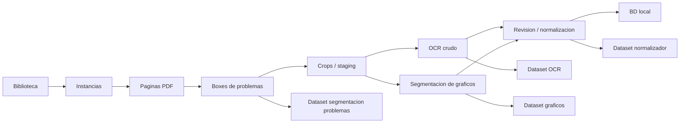
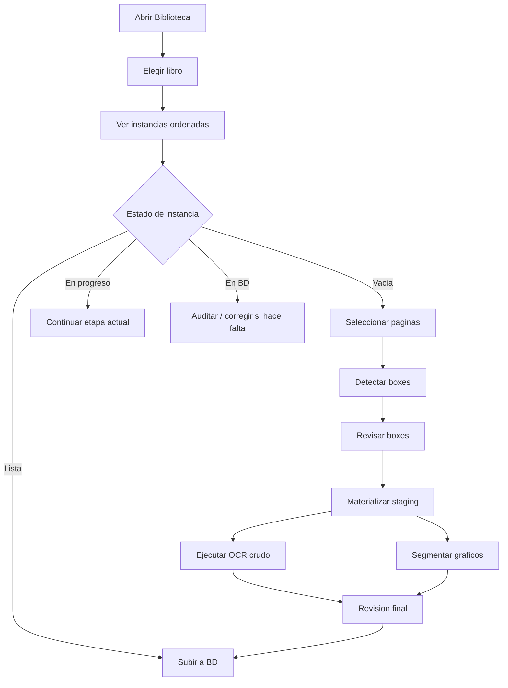

# Subagentes De Optimizacion De La App

Fecha: 2026-06-16

## Objetivo

Organizar la mejora de Auditor-IA en frentes paralelos, sin perder el flujo principal:



La prioridad actual es que la Fabrica sea estable, rapida y facil de revisar. La app debe permitir trabajar varias instancias sin confundir estado, sin perder correcciones y sin repetir trabajo.

## Subagentes Activos

| Subagente | Foco | Entregable |
| --- | --- | --- |
| Flujo de Trabajo | Cadena Biblioteca -> BD | Mapa de estados, riesgos de sincronizacion y mejoras de flujo. |
| Rendimiento | Arranque, carga, guardado y snapshots | Hotspots, cache incremental y plan de optimizacion. |
| Datos y Modelos | Staging, datasets, OCR, segmentacion y entrenamiento | Riesgos de integridad, propagacion de cambios y ciclo 500 muestras. |
| UI Visual | Biblioteca, instancias, timeline, OCR/revision | Propuesta visual limpia, responsive y sin superposiciones. |
| QA y Regresion | Tests, smoke manual y fallas Windows | Matriz de pruebas y comandos focalizados. |

## Reglas De Coordinacion

- Cada subagente trabaja en un area distinta.
- Ningun cambio debe escribir directo en `problemas` sin pasar por el flujo final aprobado.
- Si se modifica un box de Paso 2, todo lo dependiente debe quedar marcado como pendiente o regenerado: crop, OCR, segmentacion grafica, revision y candidato BD.
- Las correcciones humanas son datos de entrenamiento; no se guardan como ruido si el usuario no hizo una correccion real.
- La UI debe mostrar estado accionable, no solo contadores: vacia, en progreso, lista para BD, en BD, con errores.
- El modo visual debe priorizar lectura a zoom 100%, sin solapamientos y con controles claros.

## Flujo De Trabajo Deseado



## Criterios De Priorizacion

1. Evitar perdida de trabajo o estados inconsistentes.
2. Reducir tiempo de carga y guardado.
3. Mejorar claridad visual del flujo.
4. Aumentar calidad de datos para entrenamiento.
5. Simplificar pantallas y eliminar acciones redundantes.

## Backlog Inicial

| Prioridad | Tema | Resultado esperado |
| --- | --- | --- |
| P0 | Propagacion de cambios desde boxes | Cambiar/agregar/eliminar un box invalida o regenera dependientes sin recargar manualmente. |
| P0 | Persistencia de jobs OCR | Recargar pagina no corta solicitudes; endpoint solo se apaga cuando no hay jobs activos. |
| P1 | Carga de biblioteca/instancias | Carga incremental, menos IO repetido y filtros sin perder foco. |
| P1 | UI de instancias | Mostrar etapa actual del timeline, estado y resumen BD sin solapamientos. |
| P1 | Banco de entrenamiento | Contadores y ciclos claros para segmentacion problemas, OCR, graficos y normalizador. |
| P2 | Revision por lote | Guardado por bloque robusto, incluyendo ultimo bloque y continuaciones. |
| P2 | Estetica general | Layout mas limpio, jerarquia visual y controles compactos. |

## Primer Dictamen De Subagentes

### P0: Estabilidad De Cadena

El mayor riesgo actual es trabajar con snapshots viejos o con dos ventanas sobre la misma instancia. Si un box cambia, los crops, OCR, segmentos, revision y candidato BD deben quedar sincronizados con una firma de dependencia.

Acciones:

- Agregar lock por instancia para operaciones que tocan Golden PDF, crops, staging y manifests.
- Exigir `source_dependency_signature` en guardado de OCR, segmentos, revision y promocion.
- Rechazar guardados si el cliente manda una version vieja.
- Bloquear escritura tardia de jobs OCR/segmentacion si el record fue invalidado mientras el job corria.

### P0: Persistencia De Jobs

Los jobs OCR no deben depender solo de la pestaña abierta. Si se recarga la pagina, el job debe continuar; si hay varios jobs, el endpoint solo debe apagarse cuando no existan leases activos.

Acciones:

- Mantener estado de job por instancia y record.
- Mostrar reconexion del job desde la UI.
- Verificar leases antes de apagar endpoint.
- Evitar que dos jobs escriban el mismo record al mismo tiempo.

### P1: Rendimiento

Varias acciones pequeñas reconstruyen snapshots, manifests o indices completos. Eso explica guardados lentos y carga pesada al trabajar muchas instancias.

Acciones:

- Cachear estadisticas de sesiones por `path + mtime + size`.
- Cachear introspeccion de BD.
- Devolver deltas en guardados compactos en vez de snapshot completo.
- Convertir actualizaciones de manifests a modo incremental donde aplique.
- Ejecutar OCR/segmentacion en batch real por fase, no record por record con reinicializacion.

### P1: UI Visual

La UI debe parecer una mesa de trabajo, no una suma de paneles. La Biblioteca debe ser catalogo, las instancias filas de avance y la Fabrica un workbench por etapa.

Acciones:

- En instancias, usar filas compactas: nombre, estado, etapa actual, resumen BD y acciones.
- En Boxes, dar prioridad al canvas; mover paginas/boxes a panel derecho con tabs.
- En OCR/Revisión, colapsar detalles tecnicos por defecto.
- En pantallas medianas, convertir inspector en drawer o panel inferior para evitar superposiciones.
- Hacer toolbars sticky dentro del area de trabajo.

### P1: QA

La regresion focalizada de Fabrica/Biblioteca y OCR esta sana; la suite completa depende de `jsonschema`.

Comandos base:

```powershell
.\.venv\Scripts\python.exe -m unittest tests.test_segmentador_v2_paths tests.test_instance_factory_staging tests.test_instance_factory_web_server tests.test_library_web_api
.\.venv\Scripts\python.exe -m unittest tests.scan_pipeline.test_pipeline_strict_json tests.scan_pipeline.test_prompt_regressions tests.scan_pipeline.test_latex_normalizer tests.test_normalizer_input_dataset tests.test_local_ocr_lab_dataset tests.test_local_ocr_eval
.\.venv\Scripts\python.exe -m unittest tests.test_problem_detector_corrections tests.test_graph_detector_feedback_dataset tests.test_hf_endpoint_manager tests.test_instance_factory_db_promotion
```

## Orden Recomendado De Implementacion

1. Proteger integridad: locks por instancia, firmas de dependencia y guard final contra jobs viejos.
2. Optimizar guardados pequenos: deltas, cache de sesiones y evitar snapshots completos.
3. Mejorar flujo visual de instancias y etapa actual.
4. Rediseñar layout de Boxes y OCR/Revisión.
5. Reforzar datasets de entrenamiento con solo correcciones humanas validas.

## Definicion De Listo

- Cambio probado con tests focalizados o smoke manual.
- Estado visible en UI.
- Sin escritura directa accidental a BD final.
- Correcciones utiles almacenadas como entrenamiento.
- Documentacion actualizada si cambia el flujo.
