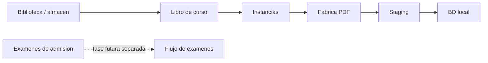
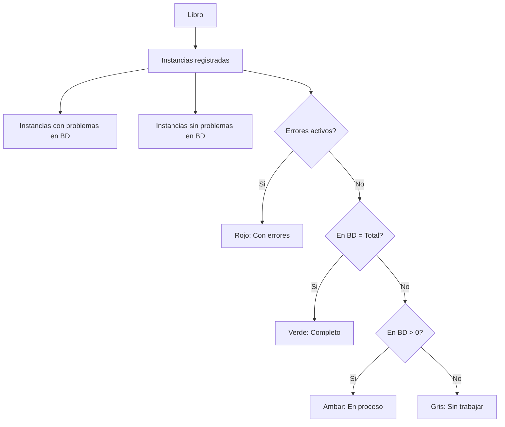
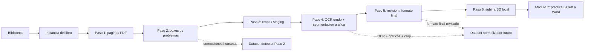
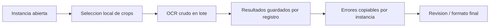
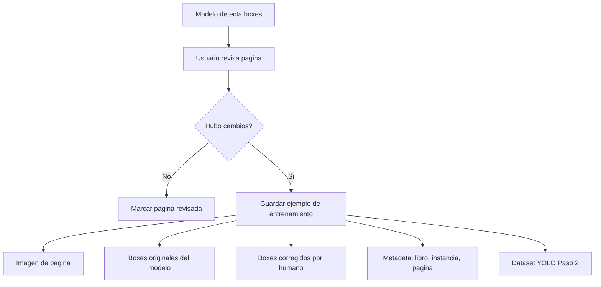
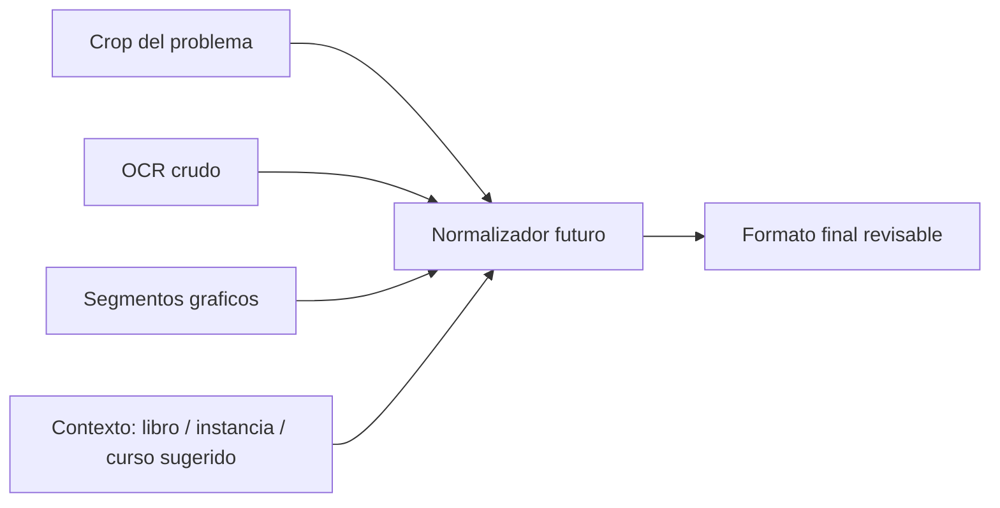
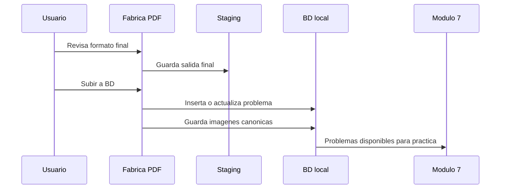
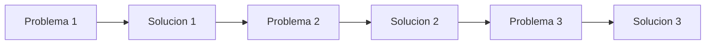
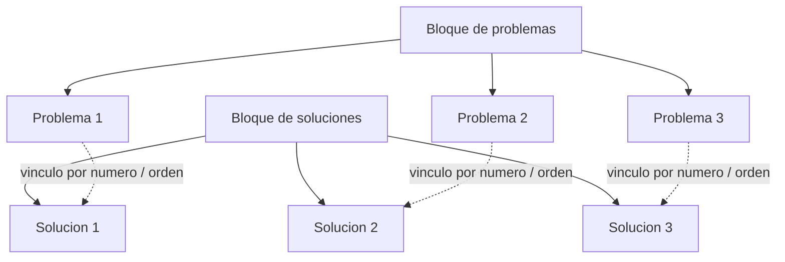

# Roadmap de mejora: Fabrica PDF, modelos y base de datos

Este documento es la guia viva para mejorar la app sin perder el rumbo. Cada idea nueva debe entrar aqui como decision, pendiente o cambio de arquitectura antes de implementarse.

## Objetivo general

Construir un flujo confiable para convertir PDFs escaneados en problemas matematicos revisados, entrenables y finalmente almacenables en la base de datos local.

El orden de prioridad actual es:

1. Mejorar el detector de problemas del Paso 2.
2. Mantener OCR crudo y segmentacion de graficos estables.
3. Preparar dataset para el futuro modelo normalizador.
4. Subir a la base de datos solo cuando el problema este revisado.
5. Mas adelante, vincular problemas con sus soluciones.

## Principios de trabajo

- La Biblioteca es el almacen inicial de libros por curso.
- Por ahora no mezclamos libros de tipo `Examenes` en la Biblioteca operativa.
- Los examenes de admision seran una fase separada, con metadata propia y reglas distintas.
- Todo pasa primero por staging.
- Nada se debe escribir directo en `problemas` sin accion final explicita.
- Toda correccion humana debe servir como dato de entrenamiento.
- No guardamos ejemplos faciles en exceso; priorizamos los errores reales del modelo.
- La app debe mostrar siempre de donde viene cada problema: libro, instancia, pagina, crop, OCR y graficos.
- El formato final debe ser compatible con Modulo 7 LaTeX a Word y con la base local.
- Se retira el `Carrito OCR global`: en la practica resulto incomodo. El OCR se trabaja desde la cola local de cada instancia.

## Almacen y Biblioteca

La Biblioteca es el punto de entrada. Su responsabilidad es registrar libros de cursos, dividirlos en instancias trabajables y mantener el estado de avance de cada instancia.

En esta etapa la Biblioteca debe permanecer simple:

- un libro representa material de un curso;
- una instancia representa un capitulo, semana, tema o tramo del libro;
- la Fabrica se abre desde una instancia concreta;
- los indicadores muestran si la instancia esta pendiente, en progreso, con errores, revisada o subida a BD;
- cada libro debe mostrar cuantas instancias tiene, cuantas ya fueron agregadas a BD y cuantas faltan;
- los examenes no entran en esta biblioteca operativa hasta que tengamos un flujo especifico para ellos.



### Decision actual sobre examenes

Se eliminan de la Biblioteca operativa los libros clasificados como `Examenes`. Si un material menciona examenes pero pertenece claramente a un curso, por ejemplo un libro de Geometria con problemas de admision, se mantiene como libro de curso.

### Indicadores de avance por libro

Para controlar que libros faltan trabajar, la Biblioteca debe mostrar una fila o tarjeta por libro con estos indicadores:

| Indicador | Significado |
| --- | --- |
| `Instancias` | Total de instancias registradas para el libro. |
| `En BD` | Instancias que ya tienen problemas subidos a la base local. |
| `Faltan` | Instancias registradas que todavia no tienen subida confirmada a BD. |

Regla inicial:

```text
faltan = instancias_total - instancias_en_bd
```

Una instancia cuenta como `En BD` si existe al menos un problema en `problemas` con el mismo `libro_codigo` y `codigo_instancia`.

### Colores de estado por libro

La Biblioteca debe usar colores consistentes para que sea facil ver el avance sin abrir cada libro.

| Estado visual | Regla inicial | Color sugerido | Uso |
| --- | --- | --- | --- |
| `Sin trabajar` | `instancias_en_bd = 0` | Gris / azul apagado | Ninguna instancia fue subida a BD. |
| `En proceso` | `0 < instancias_en_bd < instancias_total` | Amarillo / ambar | Ya hay trabajo hecho, pero faltan instancias. |
| `Completo` | `instancias_total > 0` y `instancias_en_bd = instancias_total` | Verde | Todas las instancias del libro tienen subida a BD. |
| `Con errores` | alguna instancia tiene errores activos en staging | Rojo / naranja | Requiere revision antes de continuar. |

Regla de prioridad visual:

```text
Con errores > Completo > En proceso > Sin trabajar
```

Esto significa que si un libro tiene errores activos, se debe mostrar como `Con errores` aunque tambien tenga instancias subidas a BD.



Ejemplo visual esperado:

| Libro | Instancias | En BD | Faltan | Estado | Color |
| --- | ---: | ---: | ---: | --- | --- |
| Algebra I | 12 | 8 | 4 | En proceso | Ambar |
| Geometria Semianual | 9 | 9 | 0 | Completo | Verde |
| Trigonometria | 10 | 0 | 10 | Sin trabajar | Gris |
| Geometria avanzada | 8 | 5 | 3 | Con errores | Rojo |

## Flujo principal esperado



### Decision sobre procesamiento OCR

El procesamiento OCR se mantiene dentro de cada instancia.

La idea del `Carrito OCR global` queda descartada porque agregaba complejidad visual y operativa: era mas dificil saber que instancia estaba activa, que errores pertenecian a cada libro y cuando convenia reintentar. Para optimizar costos del endpoint OCR, la ruta preferida sera mejorar la cola local por instancia:

- seleccionar todos o solo errores dentro de una instancia;
- ejecutar OCR crudo en lote;
- guardar resultados uno por uno mientras avanza la cola;
- mostrar errores copiables por instancia;
- apagar el endpoint solo cuando no queden trabajos activos de OCR.



## Fase 1: mejorar detector de problemas del Paso 2

### Problema

El modelo de segmentacion de problemas puede detectar boxes incorrectos:

- une dos problemas en un solo box;
- corta un problema;
- omite un problema;
- detecta texto que no corresponde;
- desordena la lectura;
- confunde solucion con problema.

### Decision

Guardar ejemplos de entrenamiento solo cuando el usuario modifica algo respecto a lo propuesto por el modelo.

Si el modelo acierta y el usuario no toca nada, no se guarda como ejemplo prioritario.

### Flujo de captura de correcciones



### Contrato propuesto: correccion de boxes

Archivo por pagina corregida:

```text
datasets/problem_detector_corrections/
  images/
    page_000001.png
  labels/
    page_000001.txt
  metadata/
    page_000001.json
```

`labels/page_000001.txt` contiene los boxes finales en formato YOLO.

`metadata/page_000001.json` debe conservar:

```json
{
  "schema_version": "problem_detector_correction_v1",
  "book_code": "aseuni-semianual-geometria",
  "instance_type": "semana_2_lineas_notables",
  "page_number": 3,
  "source_pdf": "ASEUNI SEMIANUAL - GEOMETRIA.pdf",
  "model_name": "pdf_problem_detector_yolov8n_v4",
  "model_boxes": [
    {"class": "problem", "xyxy": [10, 20, 300, 160], "confidence": 0.91}
  ],
  "human_boxes": [
    {"class": "problem", "xyxy": [12, 22, 298, 180], "order": 1}
  ],
  "change_summary": {
    "added": 0,
    "removed": 0,
    "moved_or_resized": 1,
    "reordered": 0
  }
}
```

### Reglas para decidir si guardar ejemplo

Guardar si:

- se agrega un box;
- se elimina un box;
- se mueve o redimensiona un box mas que un umbral pequeno;
- cambia el orden de lectura;
- se marca que la pagina tenia deteccion incorrecta.

No guardar si:

- solo se abre la pagina;
- se marca revisada sin cambios;
- el cambio es menor y no afecta el crop.

## Fase 2: OCR crudo y segmentacion grafica

El OCR crudo es la fuente principal. No se debe depender del OCR estructurado anterior para normalizar.

La segmentacion grafica debe producir imagenes reales asociadas al problema. La etiqueta final debe apuntar a un nombre estable:

```latex
[[Imagen=img-15]]
```

Al subir a BD, la imagen fisica debe guardarse con ese mismo marcador:

```text
db_images/img-15.png
```

Si hay mas de una imagen en el mismo problema:

```text
db_images/img-15.png
db_images/img-15-2.png
```

## Fase 3: normalizacion futura

El normalizador todavia no es el objetivo inmediato. Primero necesitamos buenos recortes, OCR crudo y graficos bien vinculados.

Entrada futura del normalizador:



Salida esperada:

```latex
\item[\textbf{15.}] [[curso=Geometria]] [[tema=Triangulos]] [[Estado=sin_revisar]] [[Clave=E]] Calcule $x$. [[Imagen=img-15]] £A)$10$æB)$20$æC)$45$£D)$30$ææE)$60$£
```

## Fase 4: subida a base de datos local

La subida a BD debe ocurrir solo despues de revision.



## Meta futura: diferenciar problemas y soluciones

Este punto queda trazado, pero se trabajara despues de estabilizar el detector de problemas.

Hay dos esquemas principales.

### Esquema A: problema y solucion intercalados



Relacion esperada:

```text
Problema 1 -> Solucion 1
Problema 2 -> Solucion 2
Problema 3 -> Solucion 3
```

### Esquema B: problemas primero, soluciones despues



Relacion esperada:

```text
Problema 1 -> Solucion 1
Problema 2 -> Solucion 2
Problema 3 -> Solucion 3
```

### Modelo futuro posible

Mas adelante se puede entrenar o construir una capa que clasifique cada bloque como:

- `problema`
- `solucion`
- `continuacion_problema`
- `continuacion_solucion`
- `ruido`

Luego una capa de vinculacion relacionaria problema y solucion por:

- numero detectado;
- orden visual;
- cercania en el PDF;
- encabezados como `Solucion`, `Resolucion`, `Clave`, `Rpta`;
- revision humana cuando haya duda.

## Backlog vivo

| ID | Prioridad | Tema | Estado | Descripcion |
| --- | --- | --- | --- | --- |
| M-001 | Alta | Dataset detector Paso 2 | Pendiente | Guardar ejemplos cuando se modifican boxes del modelo. |
| M-002 | Alta | Canon de imagenes | En curso | Mantener `[[Imagen=img-n]]` sincronizado con archivos fisicos y BD. |
| M-003 | Alta | OCR crudo estable | En curso | Trabajar solo con OCR crudo como entrada principal. |
| M-004 | Media | Dataset normalizador | Pendiente | Exportar OCR, crop, grafico y formato final revisado. |
| M-005 | Media | Subida BD revisada | En curso | Insertar/actualizar solo desde accion final. |
| M-006 | Futura | Problema vs solucion | Planificado | Clasificar bloques y vincular cada problema con su solucion. |
| M-007 | Alta | Biblioteca de cursos | En curso | Mantener la biblioteca operativa solo con libros de cursos; examenes quedan fuera por ahora. |
| M-008 | Alta | Indicadores por libro | Pendiente | Mostrar total de instancias, instancias agregadas a BD y faltantes por libro. |

## Registro de decisiones

### D-001: Correcciones como entrenamiento

Solo se guardan ejemplos para el detector de problemas cuando el usuario modifica los boxes propuestos.

### D-002: El marcador de imagen manda

Si el formato final contiene `[[Imagen=img-15]]`, ese marcador debe ser el nombre canonico para resolver la imagen en Modulo 7 y en la base de datos.

### D-003: Soluciones quedan para fase futura

La relacion problema-solucion es una meta importante, pero no debe bloquear la mejora actual del detector de problemas.

### D-004: Biblioteca solo de cursos por ahora

Los libros clasificados como `Examenes` se eliminan de la Biblioteca operativa. Los examenes de admision se retomaran en una fase futura con metadata y reglas propias.

### D-005: Control de avance por libro

La Biblioteca debe permitir identificar rapidamente que libros ya estan completos y cuales tienen instancias pendientes. El criterio inicial de instancia agregada a BD sera la existencia de al menos un problema asociado a `libro_codigo + codigo_instancia`.

## Preguntas abiertas

- Que umbral exacto define que un box fue modificado de forma significativa?
- Queremos guardar tambien un porcentaje pequeno de aciertos del modelo para evitar sesgo hacia errores?
- La clase inicial del detector sera solo `problem` o conviene preparar clases futuras como `solution` y `header`?
- En PDFs con soluciones, queremos detectar soluciones con el mismo modelo de boxes o con un clasificador posterior?
- Cuando retomemos examenes, iran en una biblioteca separada o como tipo especial dentro de la misma tabla?
- Para marcar una instancia como `En BD`, basta con un problema subido o exigimos un minimo esperado de problemas?
